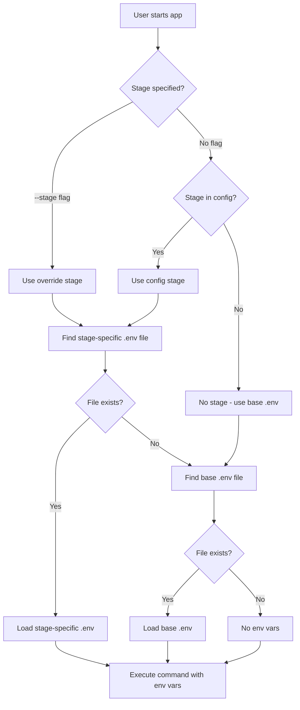

# Design Document: Environment Stage Management

## Overview

This feature extends the RustyCLI system to support multiple deployment stages (dev, qa, preprod, prod) across different runtime environments (local, docker, orbstack, k8s). The design maintains backward compatibility with existing configurations while adding stage-aware environment file loading.

### Key Design Principles

1. **Backward Compatibility**: Existing configurations without stage information continue to work unchanged
2. **Explicit Over Implicit**: Stage configuration is optional and explicit when used
3. **Consistent Patterns**: Follow existing code patterns for environment detection and command execution
4. **Minimal Invasiveness**: Changes are localized to specific modules with clear boundaries
5. **Fail-Safe Defaults**: Missing stage-specific files fall back to base .env files

## Architecture

### High-Level Flow



### Module Responsibilities

1. **config/models.rs**: Define stage field in App struct
2. **detection/environments/**: Extend env file detection to support stage-specific files
3. **commands/start/**: Pass stage information through execution pipeline
4. **commands/config/**: Add stage management to config edit commands
5. **commands/auto_add/**: Detect and configure stages during auto-add
6. **tui/**: Display stage information in monitor view

## Components and Interfaces

### 1. Configuration Model Changes

**File**: `rustycli-core/src/config/models.rs`

Add optional `stage` field to the `App` struct:

```rust
#[derive(Debug, Clone, Serialize, Deserialize)]
pub struct App {
    #[serde(rename = "type")]
    pub app_type: String,
    pub path: String,
    pub commands: Commands,
    #[serde(default)]
    pub dependencies: Vec<Dependency>,
    pub defaults: Defaults,
    #[serde(default, skip_serializing_if = "Option::is_none")]
    pub dockerfile_path: Option<String>,

    // NEW: Optional deployment stage
    #[serde(default, skip_serializing_if = "Option::is_none")]
    pub stage: Option<String>,
}
```

Add a `Stage` enum for validation:

```rust
/// Supported deployment stages
#[derive(Debug, Clone, Copy, PartialEq, Eq, Serialize, Deserialize)]
#[serde(rename_all = "lowercase")]
pub enum Stage {
    Dev,
    Qa,
    Preprod,
    Prod,
}

impl Stage {
    pub const fn all() -> &'static [Stage] {
        &[Stage::Dev, Stage::Qa, Stage::Preprod, Stage::Prod]
    }

    pub const fn as_str(&self) -> &'static str {
        match self {
            Stage::Dev => "dev",
            Stage::Qa => "qa",
            Stage::Preprod => "preprod",
            Stage::Prod => "prod",
        }
    }

    pub fn from_string(s: &str) -> Option<Self> {
        match s {
            "dev" => Some(Stage::Dev),
            "qa" => Some(Stage::Qa),
            "preprod" => Some(Stage::Preprod),
            "prod" => Some(Stage::Prod),
            _ => None,
        }
    }

    pub fn all_names() -> String {
        Self::all()
            .iter()
            .map(|s| s.as_str())
            .collect::<Vec<_>>()
            .join(", ")
    }
}
```

### 2. Environment File Detection

**File**: `rustycli-core/src/detection/environments/orbstack.rs` (and similar for docker)

Extend `find_env_file` to support stage-specific files:

```rust
/// Find the appropriate .env file based on stage and priority order
///
/// Priority order:
/// 1. Stage-specific file at Dockerfile level (e.g., docker/.env.dev)
/// 2. Stage-specific file at root level (e.g., .env.dev)
/// 3. Base .env file at Dockerfile level
/// 4. Base .env file at root level
///
/// # Arguments
/// * `app_path` - The root directory of the app
/// * `dockerfile_path` - Optional relative path to Dockerfile from config
/// * `stage` - Optional deployment stage (dev, qa, preprod, prod)
///
/// # Returns
/// Path to .env file if found, relative to app_path
pub fn find_env_file(
    app_path: &Path,
    dockerfile_path: Option<&str>,
    stage: Option<&str>
) -> Result<Option<String>> {
    // Helper to check if a file exists and return its relative path
    let check_file = |path: &Path| -> Option<String> {
        if path.exists() {
            path.strip_prefix(app_path)
                .ok()
                .map(|p| p.to_string_lossy().to_string())
        } else {
            None
        }
    };

    // Determine the Dockerfile directory
    let dockerfile_dir = if let Some(dockerfile_rel_path) = dockerfile_path {
        let dockerfile_full_path = app_path.join(dockerfile_rel_path);
        dockerfile_full_path.parent().map(|p| p.to_path_buf())
    } else {
        find_dockerfile(app_path)?
            .and_then(|df| df.parent().map(|p| p.to_path_buf()))
    };

    // If stage is specified, try stage-specific files first
    if let Some(stage_name) = stage {
        let stage_filename = format!(".env.{}", stage_name);

        // 1. Try stage-specific file at Dockerfile level
        if let Some(ref dir) = dockerfile_dir {
            if let Some(path) = check_file(&dir.join(&stage_filename)) {
                return Ok(Some(path));
            }
        }

        // 2. Try stage-specific file at root level
        if let Some(path) = check_file(&app_path.join(&stage_filename)) {
            return Ok(Some(path));
        }
    }

    // 3. Fall back to base .env at Dockerfile level
    if let Some(ref dir) = dockerfile_dir {
        if let Some(path) = check_file(&dir.join(".env")) {
            return Ok(Some(path));
        }
    }

    // 4. Fall back to base .env at root level
    if let Some(path) = check_file(&app_path.join(".env")) {
        return Ok(Some(path));
    }

    Ok(None)
}
```

Update `load_env_vars_for_runtime` signature:

```rust
pub fn load_env_vars_for_runtime(
    app_path: &Path,
    dockerfile_path: Option<&str>,
    stage: Option<&str>
) -> Result<HashMap<String, String>>
```

### 3. Command Execution Pipeline

**File**: `rustycli-core/src/commands/start/resolver.rs`

Add stage field to `StartCommandArgs`:

```rust
pub struct StartCommandArgs {
    pub app_names: Vec<String>,
    pub project: Option<String>,
    pub env: Option<String>,
    pub command: Option<String>,
    pub skip_deps: bool,
    pub silent: bool,

    // NEW: Optional stage override
    pub stage: Option<String>,
}
```

**File**: `rustycli-core/src/commands/start/executor.rs`

Modify `start_single_app_process` to accept and use stage:

```rust
async fn start_single_app_process(
    resolved_app: crate::config::resolver::ResolvedApp,
    command: String,
    default_command: String,
    environment: String,
    show_output: bool,
    stage_override: Option<String>, // NEW parameter
) -> Result<String>
```

Inside the function, determine the effective stage:

```rust
// Determine which stage to use (override takes precedence)
let effective_stage = stage_override
    .or_else(|| resolved_app.app.stage.clone());

// Validate stage if present
if let Some(ref stage) = effective_stage {
    use crate::config::models::Stage;
    if Stage::from_string(stage).is_none() {
        anyhow::bail!(
            "Invalid stage '{}'. Must be one of: {}",
            stage,
            Stage::all_names()
        );
    }
}
```

Update environment file detection calls:

```rust
match environment.as_str() {
    "docker" => {
        env_vars.insert("DOCKER_CONTEXT".to_string(), "default".to_string());

        // Find env file with stage support
        if let Ok(Some(env_file_path)) = crate::detection::find_env_file(
            &working_dir,
            resolved_app.app.dockerfile_path.as_deref(),
            effective_stage.as_deref()
        ) {
            final_command = crate::utils::command::inject_docker_env_file(
                &final_command,
                &env_file_path
            );

            // Log which file is being used
            if show_output {
                println!("  Using env file: {}", env_file_path);
            }
        }

        // ... rest of docker setup
    }
    "orbstack" => {
        // Similar changes for orbstack
    }
    _ => {}
}
```

### 4. Config Command Extensions

**File**: `rustycli-core/src/commands/config/edit.rs`

Add new function for stage management:

```rust
/// Set the deployment stage for an app
///
/// Example: `rustycli config set-stage api dev`
/// Example: `rustycli config set-stage api --project qm qa`
/// Example: `rustycli config set-stage api none` (removes stage)
///
/// Sets the deployment stage for an app, which determines which .env file to use.
///
/// # Arguments
///
/// * `app_name` - Optional app name (prompts if not provided)
/// * `project` - Optional project name to resolve ambiguous app names
/// * `stage` - Optional stage value (dev, qa, preprod, prod, none) (prompts if not provided)
pub async fn config_set_stage(
    app_name: Option<String>,
    project: Option<String>,
    stage: Option<String>,
) -> Result<()> {
    let mut config = load_config()?;

    // Resolve app
    let (resolved_project, resolved_app_name) = if let Some(app_name) = app_name {
        let resolved = resolve_app(&config, &app_name, project.as_deref())?;
        (resolved.project, resolved.app_name)
    } else {
        crate::commands::config::prompt_for_app(&config, project.as_deref())?
    };

    // Get or prompt for stage
    let stage_value = if let Some(s) = stage {
        s
    } else {
        use inquire::Select;
        let options = vec!["dev", "qa", "preprod", "prod", "none"];
        Select::new("Select deployment stage:", options)
            .prompt()?
            .to_string()
    };

    // Validate stage
    if stage_value != "none" {
        use crate::config::models::Stage;
        if Stage::from_string(&stage_value).is_none() {
            anyhow::bail!(
                "Invalid stage '{}'. Must be one of: {}, none",
                stage_value,
                Stage::all_names()
            );
        }
    }

    // Update app config
    let app = config
        .projects
        .get_mut(&resolved_project)
        .unwrap()
        .apps
        .get_mut(&resolved_app_name)
        .unwrap();

    if stage_value == "none" {
        app.stage = None;
        println!("✓ Removed stage from {}/{}", resolved_project, resolved_app_name);
    } else {
        app.stage = Some(stage_value.clone());
        println!("✓ Set stage to '{}' for {}/{}", stage_value, resolved_project, resolved_app_name);
    }

    // Save config
    save_config(&config)?;

    Ok(())
}
```

**File**: `rustycli-core/src/commands/config/list.rs`

Extend app listing to show stage information:

```rust
// In the app details display section, add:
if let Some(ref stage) = app.stage {
    println!("  Stage: {}", stage);
}

// Show which env files would be used
println!("\n  Environment Files:");
for env in ["local", "docker", "orbstack", "k8s"] {
    if app.commands.get(env).is_some() {
        let env_file = crate::detection::find_env_file(
            &expanded_path,
            app.dockerfile_path.as_deref(),
            app.stage.as_deref()
        ).ok().flatten();

        match env_file {
            Some(path) => println!("    {}: {}", env, path),
            None => println!("    {}: No environment file", env),
        }
    }
}
```

### 5. Auto-Add Command Enhancement

**File**: `rustycli-core/src/commands/auto_add/interactive.rs`

Add stage detection and prompting:

```rust
/// Detect available stage-specific env files
fn detect_stage_files(app_path: &Path) -> Vec<String> {
    let mut stages = Vec::new();

    for stage in ["dev", "qa", "preprod", "prod"] {
        let stage_file = app_path.join(format!(".env.{}", stage));
        if stage_file.exists() {
            stages.push(stage.to_string());
        }
    }

    stages
}

// In the interactive prompting section:
let available_stages = detect_stage_files(&app_path);
let stage = if !available_stages.is_empty() {
    use inquire::Select;

    println!("\nDetected stage-specific environment files:");
    for s in &available_stages {
        println!("  .env.{}", s);
    }

    let mut options = available_stages.clone();
    options.push("none".to_string());

    let selected = Select::new(
        "Select default deployment stage:",
        options
    )
    .with_help_message("Choose which stage to use by default, or 'none' to skip")
    .prompt()?;

    if selected == "none" {
        None
    } else {
        Some(selected)
    }
} else {
    None
};

// Add to app config
let app = App {
    app_type,
    path: app_path_str,
    commands,
    dependencies: Vec::new(),
    defaults,
    dockerfile_path,
    stage, // NEW field
};
```

### 6. TUI Integration

**File**: `rustycli-core/src/tui/views/main_view/renderer.rs`

Update the app list rendering to show stage:

```rust
// In the render_app_list function, add stage indicator
let stage_indicator = if let Some(ref stage) = app.stage {
    format!(" [{}]", stage.to_uppercase())
} else {
    String::new()
};

let app_line = format!(
    "  {} {}{}{}",
    status_icon,
    app_name,
    stage_indicator, // NEW
    env_indicator
);
```

**File**: `rustycli-core/src/process/tracker.rs`

Add stage field to `ProcessInfo`:

```rust
#[derive(Debug, Clone, Serialize, Deserialize)]
pub struct ProcessInfo {
    pub app_name: String,
    pub pid: u32,
    pub command: String,
    pub working_dir: String,
    pub start_time: DateTime<Utc>,
    pub env_vars: HashMap<String, String>,
    pub project: Option<String>,
    pub app_config_name: Option<String>,
    pub environment: Option<String>,
    pub command_variant: Option<String>,

    // NEW: Track which stage was used
    #[serde(default, skip_serializing_if = "Option::is_none")]
    pub stage: Option<String>,
}
```

## Data Models

### Configuration JSON Structure

```json
{
  "projects": {
    "my-project": {
      "apps": {
        "api": {
          "type": "nodejs",
          "path": "~/projects/api",
          "stage": "dev",
          "commands": {
            "local": {
              "start": "npm start",
              "test": "npm test"
            },
            "docker": {
              "build": "docker build -t api .",
              "run": "docker run --name api --rm -p 3000:3000 api"
            }
          },
          "defaults": {
            "local": "start",
            "docker": "run"
          },
          "dockerfile_path": "Dockerfile"
        }
      }
    }
  }
}
```

### Environment File Naming Convention

- Base file: `.env`
- Stage-specific files: `.env.dev`, `.env.qa`, `.env.preprod`, `.env.prod`

### Priority Order Examples

**Scenario 1**: App with stage="dev" and Dockerfile in root

1. `.env.dev` (root) ✓
2. `.env` (root)

**Scenario 2**: App with stage="qa" and Dockerfile in `docker/` subdirectory

1. `docker/.env.qa` ✓
2. `.env.qa` (root)
3. `docker/.env`
4. `.env` (root)

**Scenario 3**: App with no stage configured

1. `docker/.env` (if Dockerfile in docker/)
2. `.env` (root) ✓

## Error Handling

### Stage Validation Errors

```rust
// Invalid stage value
if Stage::from_string(&stage).is_none() {
    anyhow::bail!(
        "Invalid stage '{}'. Must be one of: {}",
        stage,
        Stage::all_names()
    );
}
```

### Missing Environment File Warnings

```rust
// Stage-specific file not found, falling back
if let Some(ref stage) = effective_stage {
    if show_output {
        println!(
            "⚠ Warning: .env.{} not found, falling back to .env",
            stage
        );
    }
}
```

### File Read Errors

```rust
// Failed to read env file
let env_vars = parse_env_file(&env_path)
    .with_context(|| format!(
        "Failed to read environment file: {}",
        env_path.display()
    ))?;
```

## Testing Strategy

### Unit Tests

1. **Stage Validation Tests** (`config/models_test.rs`)

   - Valid stage values (dev, qa, preprod, prod)
   - Invalid stage values
   - Stage enum conversion

2. **Environment File Detection Tests** (`detection/environments/orbstack_test.rs`)

   - Stage-specific file priority
   - Fallback to base .env
   - Dockerfile directory vs root directory
   - Missing files

3. **Config Serialization Tests** (`config/config_tests.rs`)
   - Stage field serialization/deserialization
   - Optional stage field (skip_serializing_if)
   - Backward compatibility with configs without stage

### Integration Tests

1. **Start Command with Stage** (`commands/start/executor_test.rs`)

   - Start app with stage from config
   - Start app with --stage override
   - Stage validation during start
   - Environment variable loading with stage

2. **Config Command Tests** (`commands/config/edit_test.rs`)

   - Set stage via config set-stage
   - Remove stage (set to none)
   - List apps showing stage information

3. **Auto-Add Tests** (`commands/auto_add/interactive_test.rs`)
   - Detect stage-specific files
   - Prompt for stage selection
   - Skip stage configuration

### Manual Testing Scenarios

1. **Backward Compatibility**

   - Load existing config without stage field
   - Start apps without stage configuration
   - Verify base .env files still work

2. **Stage Override**

   - Start app with --stage flag
   - Verify override doesn't persist to config
   - Check correct env file is loaded

3. **TUI Display**

   - View apps with stages in monitor
   - Verify stage indicators are visible
   - Check stage info in process details

4. **Error Messages**
   - Invalid stage value
   - Missing stage-specific file
   - File read errors

## Migration Path

### For Existing Users

1. **No Action Required**: Existing configurations continue to work without modification
2. **Optional Adoption**: Users can add stage configuration incrementally
3. **Gradual Migration**: Add stage-specific files as needed per app

### Adding Stage Support to Existing App

```bash
# 1. Create stage-specific env files
cp .env .env.dev
cp .env .env.qa
cp .env .env.prod

# 2. Edit each file with stage-specific values
vim .env.dev .env.qa .env.prod

# 3. Set default stage for app
rustycli config set-stage my-app dev

# 4. Test with different stages
rustycli start my-app --stage qa
rustycli start my-app --stage prod
```

## Performance Considerations

1. **File System Checks**: Multiple file existence checks during env file detection

   - Mitigation: Checks are sequential and short-circuit on first match
   - Impact: Negligible (< 1ms per app start)

2. **Config File Size**: Adding stage field increases config size minimally

   - Impact: ~10-20 bytes per app
   - Mitigation: Field is optional and omitted when not set

3. **Memory Usage**: Stage information stored in memory structures
   - Impact: ~8 bytes per app (Option<String>)
   - Mitigation: Minimal, scales linearly with app count

## Security Considerations

1. **Environment File Access**: Stage-specific files may contain sensitive data

   - Recommendation: Use same file permissions as .env files (0600)
   - Warning: Document that stage files should not be committed to version control

2. **Stage Override**: --stage flag allows runtime override

   - Risk: User could accidentally load wrong environment
   - Mitigation: Display which env file is being used in output

3. **Validation**: Stage values are validated before use
   - Protection: Prevents arbitrary file path injection
   - Implementation: Whitelist of allowed stage values

## Future Enhancements

1. **Stage-Specific Commands**: Allow different commands per stage

   ```json
   "commands": {
     "docker": {
       "dev": {
         "run": "docker run --debug api"
       },
       "prod": {
         "run": "docker run --optimize api"
       }
     }
   }
   ```

2. **Environment Variable Merging**: Combine base and stage-specific files

   - Load .env first, then overlay .env.{stage}
   - Allows common variables in base file

3. **Stage Profiles**: Pre-defined stage configurations

   - Templates for common stage setups
   - Quick setup for new apps

4. **Stage Validation Rules**: Enforce stage-specific requirements
   - Require certain env vars per stage
   - Validate env var formats per stage
