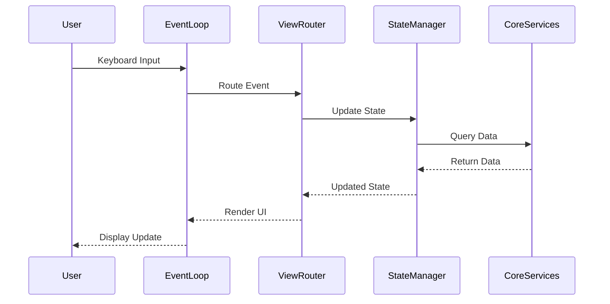

# Design Document: Interactive TUI

## Overview

This document outlines the design for an interactive Terminal User Interface (TUI) for RustyCLI. The TUI will provide a visual, keyboard-navigable interface for managing applications, viewing their status, executing commands, and inspecting logs with enhanced formatting.

The design leverages the `ratatui` library (formerly tui-rs), which is the most mature and actively maintained TUI framework in the Rust ecosystem. For log beautification, we'll use `serde_json` for JSON formatting and `syntect` for syntax highlighting.

**Design Inspiration:** The UI/UX is heavily inspired by [GitUI](https://github.com/gitui-org/gitui), featuring:

- Tab-based navigation for different views
- Split-panel layout (list on left, details on right)
- Consistent keyboard shortcuts
- Clean, modern terminal aesthetics
- Contextual help in the footer

## Architecture

### High-Level Architecture

```
┌─────────────────────────────────────────────────────────────┐
│                        CLI Entry Point                       │
│                     (rustycli ui command)                    │
└──────────────────────┬──────────────────────────────────────┘
                       │
                       ▼
┌─────────────────────────────────────────────────────────────┐
│                      TUI Application                         │
│  ┌────────────────────────────────────────────────────────┐ │
│  │              Event Loop & State Manager                 │ │
│  └────────────────────────────────────────────────────────┘ │
│  ┌────────────────────────────────────────────────────────┐ │
│  │                  View Router                            │ │
│  │  - Main View                                            │ │
│  │  - Command List View                                    │ │
│  │  - Log Browser View                                     │ │
│  │  - Log Viewer View                                      │ │
│  └────────────────────────────────────────────────────────┘ │
└──────────────────────┬──────────────────────────────────────┘
                       │
                       ▼
┌─────────────────────────────────────────────────────────────┐
│                    Core Services Layer                       │
│  ┌──────────────┐  ┌──────────────┐  ┌──────────────┐      │
│  │   Config     │  │   Process    │  │     Log      │      │
│  │   Manager    │  │   Tracker    │  │   Manager    │      │
│  └──────────────┘  └──────────────┘  └──────────────┘      │
└─────────────────────────────────────────────────────────────┘
```

### Component Interaction Flow



## Components and Interfaces

### 1. TUI Application (`tui/app.rs`)

The main application struct that manages the TUI lifecycle.

```rust
pub struct TuiApp {
    state: AppState,
    view_stack: Vec<View>,
    config_manager: ConfigManager,
    process_tracker: ProcessTracker,
    log_manager: LogManager,
    should_quit: bool,
}

impl TuiApp {
    pub fn new() -> Result<Self>;
    pub async fn run(&mut self) -> Result<()>;
    fn handle_event(&mut self, event: Event) -> Result<()>;
    fn render(&self, frame: &mut Frame);
}
```

**Responsibilities:**

- Initialize terminal and TUI backend
- Run the main event loop
- Coordinate between views and services
- Handle global keyboard shortcuts (quit, back)

### 2. State Manager (`tui/state.rs`)

Manages application state and provides state transitions.

```rust
pub struct AppState {
    pub projects: Vec<ProjectState>,
    pub selected_project_idx: usize,
    pub selected_app_idx: usize,
    pub current_view: ViewType,
    pub error_message: Option<String>,
}

pub struct ProjectState {
    pub name: String,
    pub apps: Vec<AppState>,
    pub expanded: bool,
}

pub struct AppState {
    pub name: String,
    pub app_type: String,
    pub status: AppStatus,
    pub commands: HashMap<String, Vec<String>>,
}

pub enum AppStatus {
    Running { pid: u32, uptime: Duration },
    Stopped,
}

pub enum ViewType {
    Main,
    CommandList { project: String, app: String },
    LogBrowser { project: String, app: String },
    LogViewer { log_path: PathBuf },
}
```

### 3. View Router (`tui/views/mod.rs`)

Routes rendering and events to appropriate view components.

```rust
pub trait View {
    fn render(&self, frame: &mut Frame, area: Rect, state: &AppState);
    fn handle_input(&mut self, key: KeyEvent, state: &mut AppState) -> Result<ViewAction>;
}

pub enum ViewAction {
    None,
    Push(ViewType),
    Pop,
    Quit,
    ExecuteCommand { project: String, app: String, command: String },
}
```

### 4. Main View (`tui/views/main_view.rs`)

Displays projects and apps with their running status using a tab-based, split-panel layout inspired by GitUI.

```rust
pub struct MainView {
    active_tab: MainTab,
    selected_project_idx: usize,
    selected_app_idx: usize,
    focus: PanelFocus,
    list_scroll: usize,
    detail_scroll: usize,
}

pub enum MainTab {
    Status,      // Overview of all apps with details
    Commands,    // Commands for selected app
    Logs,        // Logs for selected app
}

pub enum PanelFocus {
    AppList,      // Left panel (project/app tree)
    DetailPanel,  // Right panel (details/commands/logs)
}

impl View for MainView {
    // Renders:
    // - Tab bar at top (Status | Commands | Logs)
    // - Split view: Project/App list (30%) | Details (70%)
    // - Status indicators with colors and symbols
    // - Footer with contextual keyboard shortcuts
}
```

**Status Tab Layout (GitUI-inspired):**

```
┌──────────────────────────────────────────────────────────────────────────┐
│ [1] Status  [2] Commands  [3] Logs                         [q] Quit      │
├────────────────────────────┬─────────────────────────────────────────────┤
│ Projects & Apps (30%)      │ Details (70%)                               │
│                            │                                             │
│ ▼ my-project               │ ┌─ api-server ────────────────────────────┐ │
│   ● api-server             │ │ Status:      ● Running                  │ │
│   ○ frontend               │ │ PID:         12345                      │ │
│   ● redis                  │ │ Uptime:      2h 15m 32s                 │ │
│                            │ │ Type:        nodejs                     │ │
│ ▼ infrastructure           │ │ Path:        ~/projects/api             │ │
│   ● postgres               │ │ Environment: local                      │ │
│   ○ rabbitmq               │ │                                         │ │
│                            │ │ Dependencies:                           │ │
│                            │ │   ✓ redis (running)                     │ │
│                            │ │   ✓ postgres (running)                  │ │
│                            │ └─────────────────────────────────────────┘ │
│                            │                                             │
├────────────────────────────┴─────────────────────────────────────────────┤
│ ↑↓: Navigate  Tab: Switch Panel  1-3: Switch Tab  Enter: Start/Stop     │
└──────────────────────────────────────────────────────────────────────────┘
```

**Commands Tab Layout:**

```
┌──────────────────────────────────────────────────────────────────────────┐
│ [1] Status  [2] Commands  [3] Logs                         [q] Quit      │
├────────────────────────────┬─────────────────────────────────────────────┤
│ Projects & Apps (30%)      │ Available Commands (70%)                    │
│                            │                                             │
│ ▼ my-project               │ ┌─ api-server commands ───────────────────┐ │
│   ● api-server             │ │                                         │ │
│   ○ frontend               │ │ Local:                                  │ │
│   ● redis                  │ │  > start      npm start                 │ │
│                            │ │    test       npm test                  │ │
│ ▼ infrastructure           │ │    build      npm run build             │ │
│   ● postgres               │ │    dev        npm run dev               │ │
│   ○ rabbitmq               │ │                                         │ │
│                            │ │ Docker:                                 │ │
│                            │ │    build      docker build -t api       │ │
│                            │ │    run        docker run api            │ │
│                            │ │                                         │ │
│                            │ └─────────────────────────────────────────┘ │
│                            │                                             │
├────────────────────────────┴─────────────────────────────────────────────┤
│ ↑↓: Navigate  Enter: Execute  Tab: Switch Panel  Esc: Stop App          │
└──────────────────────────────────────────────────────────────────────────┘
```

**Logs Tab Layout:**

```
┌──────────────────────────────────────────────────────────────────────────┐
│ [1] Status  [2] Commands  [3] Logs                         [q] Quit      │
├────────────────────────────┬─────────────────────────────────────────────┤
│ Projects & Apps (30%)      │ Log Files (70%)                             │
│                            │                                             │
│ ▼ my-project               │ ┌─ api-server logs ───────────────────────┐ │
│   ● api-server             │ │                                         │ │
│   ○ frontend               │ │ > api-server.local_20251114.log         │ │
│   ● redis                  │ │   2.3 MB    Today 14:32                 │ │
│                            │ │                                         │ │
│ ▼ infrastructure           │ │   api-server.local_20251113.log         │ │
│   ● postgres               │ │   5.1 MB    Yesterday                   │ │
│   ○ rabbitmq               │ │                                         │ │
│                            │ │   api-server.local_20251112.log         │ │
│                            │ │   4.8 MB    2 days ago                  │ │
│                            │ │                                         │ │
│                            │ └─────────────────────────────────────────┘ │
│                            │                                             │
├────────────────────────────┴─────────────────────────────────────────────┤
│ ↑↓: Navigate  Enter: View Log  Tab: Switch Panel  /: Search             │
└──────────────────────────────────────────────────────────────────────────┘
```

### 5. Command Execution Popup (`tui/widgets/command_popup.rs`)

Shows a confirmation popup when executing commands, with real-time output feedback.

```rust
pub struct CommandPopup {
    command_name: String,
    command_text: String,
    state: PopupState,
    output_lines: Vec<String>,
}

pub enum PopupState {
    Confirm,           // Asking for confirmation
    Executing,         // Command is running
    Success(String),   // Command completed successfully
    Error(String),     // Command failed
}
```

**Confirmation Popup:**

```
┌──────────────────────────────────────────────────────────────────────────┐
│ [1] Status  [2] Commands  [3] Logs                         [q] Quit      │
├────────────────────────────┬─────────────────────────────────────────────┤
│ Projects & Apps (30%)      │ Available Commands (70%)                    │
│                            │                                             │
│ ▼ my-project               │  ┌─ Execute Command? ──────────────────┐   │
│   ● api-server             │  │                                      │   │
│   ○ frontend               │  │ Command: start                       │   │
│   ● redis                  │  │ Script:  npm start                   │   │
│                            │  │ App:     api-server                  │   │
│ ▼ infrastructure           │  │ Env:     local                       │   │
│   ● postgres               │  │                                      │   │
│   ○ rabbitmq               │  │ [Enter] Execute  [Esc] Cancel        │   │
│                            │  └──────────────────────────────────────┘   │
│                            │                                             │
├────────────────────────────┴─────────────────────────────────────────────┤
│ ↑↓: Navigate  Enter: Execute  Tab: Switch Panel  Esc: Cancel            │
└──────────────────────────────────────────────────────────────────────────┘
```

### 6. Log Browser (Integrated in Logs Tab)

Log browsing is integrated into the main view's Logs tab (see section 4), displaying in the right panel when an app is selected.

### 7. Log Viewer View (`tui/views/log_viewer.rs`)

Full-screen log viewer that opens when a log file is selected. Features beautification, search, and smooth scrolling.

```rust
pub struct LogViewerView {
    log_path: PathBuf,
    content: Vec<LogLine>,
    scroll_offset: usize,
    horizontal_offset: usize,
    search_mode: bool,
    search_query: String,
    search_results: Vec<usize>,
    current_search_idx: usize,
}

pub struct LogLine {
    pub raw: String,
    pub formatted: Vec<Span>,
    pub line_number: usize,
    pub is_json: bool,
}
```

**UI Layout (Full Screen):**

```
┌──────────────────────────────────────────────────────────────────────────┐
│ api-server.local_20251114.log (Line 45/1234)              [Esc] Back     │
├──────────────────────────────────────────────────────────────────────────┤
│   43 │ [2025-11-14 10:30:45.123] INFO: Server started                    │
│   44 │ [2025-11-14 10:30:46.456] {                                       │
│ > 45 │   "level": "info",                                                │
│   46 │   "message": "Request received",                                  │
│   47 │   "method": "GET",                                                │
│   48 │   "path": "/api/users",                                           │
│   49 │   "timestamp": "2025-11-14T10:30:46.456Z"                         │
│   50 │ }                                                                  │
│   51 │ [2025-11-14 10:30:47.789] Response sent (200 OK)                 │
│   52 │ [2025-11-14 10:30:48.123] {                                       │
│   53 │   "level": "debug",                                               │
│   54 │   "message": "Cache hit",                                         │
│   55 │   "key": "user:12345"                                             │
│   56 │ }                                                                  │
│                                                                           │
├──────────────────────────────────────────────────────────────────────────┤
│ ↑↓: Scroll  PgUp/PgDn: Page  Home/End  /: Search  n: Next  N: Previous  │
└──────────────────────────────────────────────────────────────────────────┘
```

**Search Mode:**

```
┌──────────────────────────────────────────────────────────────────────────┐
│ api-server.local_20251114.log (Line 45/1234)              [Esc] Back     │
├──────────────────────────────────────────────────────────────────────────┤
│   43 │ [2025-11-14 10:30:45.123] INFO: Server started                    │
│   44 │ [2025-11-14 10:30:46.456] {                                       │
│ > 45 │   "level": "info",                                                │
│   46 │   "message": "Request received",                                  │
│   47 │   "method": "GET",                                                │
│   48 │   "path": "/api/users",                                           │
│                                                                           │
├──────────────────────────────────────────────────────────────────────────┤
│ Search: Request_                                    [3 matches] (1/3)    │
└──────────────────────────────────────────────────────────────────────────┘
```

### 8. Log Manager (`tui/log_manager.rs`)

Handles log file discovery, content processing, and beautification.

```rust
pub struct LogManager {
    log_dir: PathBuf,
    syntax_set: SyntaxSet,
    theme: Theme,
}

pub struct LogFileInfo {
    pub path: PathBuf,
    pub name: String,
    pub size: u64,
    pub modified: DateTime<Utc>,
}

impl LogManager {
    pub fn new() -> Result<Self>;
    pub fn list_logs_for_app(&self, app_name: &str) -> Result<Vec<LogFileInfo>>;
    pub fn read_log_file(&self, path: &PathBuf) -> Result<Vec<LogLine>>;
    pub fn read_log_file_lazy(&self, path: &PathBuf, start: usize, count: usize) -> Result<Vec<LogLine>>;
    fn beautify_line(&self, line: &str) -> Vec<Span>;
    fn detect_json(&self, line: &str) -> bool;
    fn format_json(&self, json: &str) -> Result<String>;
    fn highlight_json(&self, json: &str) -> Vec<Span>;
}
```

### 9. Theme Manager (`tui/theme.rs`)

Manages color schemes and visual styling inspired by GitUI's theming system.

```rust
pub struct Theme {
    pub primary: Color,
    pub secondary: Color,
    pub success: Color,
    pub warning: Color,
    pub error: Color,
    pub running: Color,
    pub stopped: Color,
    pub selected_bg: Color,
    pub border: Color,
    pub text: Color,
    pub text_dim: Color,
}

impl Theme {
    pub fn default() -> Self;
    pub fn from_terminal() -> Self;  // Detect terminal colors
}
```

### 10. Config Manager Integration

Reuses existing `ConfigManager` from core library to load projects and apps.

```rust
// From rustycli-core/src/config/manager.rs
pub struct ConfigManager {
    pub fn load_config() -> Result<Config>;
    pub fn get_app(&self, project: &str, app: &str) -> Result<&App>;
}
```

### 11. Process Tracker Integration

Reuses existing `ProcessTracker` to check app status.

```rust
// From rustycli-core/src/process/tracker.rs
pub struct ProcessTracker {
    pub fn list_processes() -> Result<Vec<ProcessInfo>>;
    pub fn is_running(&self, pid: u32) -> bool;
}
```

## Data Models

### View State Models

```rust
// Represents the full application state
pub struct AppState {
    pub projects: Vec<ProjectState>,
    pub selected_project_idx: usize,
    pub selected_app_idx: usize,
    pub view_stack: Vec<ViewType>,
    pub error_message: Option<String>,
    pub status_message: Option<String>,
}

// Project with its apps
pub struct ProjectState {
    pub name: String,
    pub apps: Vec<AppState>,
    pub expanded: bool,
}

// Individual app state
pub struct AppState {
    pub name: String,
    pub project: String,
    pub app_type: String,
    pub status: AppStatus,
    pub commands: HashMap<String, Vec<CommandInfo>>,
}

// Running status
pub enum AppStatus {
    Running {
        pid: u32,
        uptime: Duration,
        start_time: DateTime<Utc>,
    },
    Stopped,
    Unknown,
}
```

## Error Handling

### Error Display Strategy

1. **Non-blocking errors**: Display in a status bar at the bottom
2. **Blocking errors**: Show modal dialog requiring acknowledgment
3. **Recoverable errors**: Log and continue with degraded functionality

```rust
pub enum TuiError {
    ConfigLoadError(String),
    ProcessTrackingError(String),
    LogReadError(String),
    CommandExecutionError(String),
    RenderError(String),
}

impl TuiApp {
    fn handle_error(&mut self, error: TuiError) {
        match error {
            TuiError::ConfigLoadError(msg) => {
                // Show modal, can't continue without config
                self.show_error_modal(msg);
            }
            TuiError::LogReadError(msg) => {
                // Show in status bar, can continue
                self.state.error_message = Some(msg);
            }
            _ => {
                self.state.error_message = Some(error.to_string());
            }
        }
    }
}
```

## Testing Strategy

### Unit Tests

1. **State Management Tests**

   - Test state transitions
   - Test selection navigation
   - Test view stack operations

2. **Log Beautification Tests**

   - Test JSON detection and formatting
   - Test line parsing
   - Test syntax highlighting application

3. **Data Model Tests**
   - Test AppState creation from Config
   - Test status determination logic

### Integration Tests

1. **View Rendering Tests**

   - Test each view renders without panic
   - Test layout calculations
   - Test keyboard navigation

2. **Event Handling Tests**
   - Test keyboard input routing
   - Test command execution flow
   - Test view transitions

### Manual Testing

1. **UI/UX Testing**

   - Test with various terminal sizes
   - Test with different color schemes
   - Test keyboard navigation flow
   - Test with large numbers of projects/apps
   - Test with long log files

2. **Performance Testing**
   - Test with large log files (>100MB)
   - Test with many apps (>50)
   - Test rapid navigation

## Technical Decisions

### TUI Library: Ratatui

**Rationale:**

- Most mature and actively maintained TUI framework in Rust
- Excellent documentation and examples
- Flexible widget system
- Good performance with large datasets
- Active community support

**Alternatives Considered:**

- `cursive`: More opinionated, less flexible
- `termion`: Lower-level, more work required

### Syntax Highlighting: Syntect

**Rationale:**

- Supports many languages and formats
- Uses Sublime Text syntax definitions
- Good performance
- Easy integration with ratatui

### Event Handling: Crossterm

**Rationale:**

- Cross-platform terminal manipulation
- Works well with ratatui
- Async-friendly
- Good keyboard event handling

### Architecture Pattern: Elm-like

**Rationale:**

- Clear separation of state and rendering
- Predictable state updates
- Easy to test
- Scales well with complexity

## Dependencies

New dependencies to add to `Cargo.toml`:

```toml
[dependencies]
ratatui = "0.25"
crossterm = "0.27"
syntect = "5.1"
```

Existing dependencies to leverage:

- `serde_json` - JSON parsing and formatting
- `chrono` - Date/time handling
- `anyhow` - Error handling
- `tokio` - Async runtime (for file I/O)

## Performance Considerations

### Log File Handling

1. **Lazy Loading**: Load log files in chunks, not all at once
2. **Caching**: Cache parsed log lines to avoid re-parsing on scroll
3. **Pagination**: Display only visible lines plus buffer

```rust
pub struct LogViewerView {
    content_cache: LruCache<usize, LogLine>,
    visible_range: Range<usize>,
    buffer_size: usize, // Lines to keep in memory beyond visible
}
```

### Status Updates

1. **Polling Interval**: Check process status every 2 seconds
2. **Incremental Updates**: Only update changed statuses
3. **Background Thread**: Use separate thread for status checks

```rust
impl TuiApp {
    async fn start_status_updater(&self) -> tokio::task::JoinHandle<()> {
        tokio::spawn(async move {
            let mut interval = tokio::time::interval(Duration::from_secs(2));
            loop {
                interval.tick().await;
                // Update process statuses
            }
        })
    }
}
```

## Accessibility Considerations

1. **Color Blindness**: Use symbols in addition to colors for status
2. **Screen Readers**: Ensure text is readable (though TUI support is limited)
3. **Keyboard Only**: All functionality accessible via keyboard
4. **Clear Visual Hierarchy**: Use borders, spacing, and indentation

## GitUI-Inspired Features

The following features are directly inspired by GitUI's excellent UX:

1. **Tab Navigation**: Number keys (1-3) for quick tab switching
2. **Split Panels**: Consistent left/right panel layout with Tab key to switch focus
3. **Visual Hierarchy**: Clear borders, spacing, and use of symbols
4. **Contextual Help**: Footer always shows relevant keyboard shortcuts
5. **Smooth Navigation**: Vim-style navigation (j/k) in addition to arrow keys
6. **Color Coding**: Consistent use of colors for status (green=running, red=stopped)
7. **Minimal Chrome**: Clean interface without unnecessary decorations

## Keyboard Shortcuts Summary

### Global

- `q`: Quit application
- `Esc`: Go back / Cancel
- `?`: Show help overlay
- `1-3`: Switch tabs (Status, Commands, Logs)

### Navigation

- `↑/k`: Move up
- `↓/j`: Move down
- `Tab`: Switch panel focus
- `Enter`: Select / Execute
- `Space`: Expand/collapse project

### Commands Tab

- `Enter`: Execute selected command
- `Esc`: Stop running app

### Logs Tab

- `Enter`: Open log viewer
- `/`: Search in current view

### Log Viewer

- `↑/↓`: Scroll line by line
- `PgUp/PgDn`: Scroll page by page
- `Home/End`: Jump to start/end
- `g/G`: Jump to top/bottom (vim-style)
- `/`: Enter search mode
- `n/N`: Next/previous search result
- `Esc`: Exit viewer

## Future Enhancements

1. **Log Filtering**: Filter logs by level, timestamp, or pattern
2. **Real-time Log Tailing**: Follow log files as they grow (like `tail -f`)
3. **Command History**: Remember recently executed commands
4. **Custom Themes**: Load themes from config file
5. **Mouse Support**: Optional mouse navigation and clicking
6. **Split View**: View multiple logs side-by-side
7. **Export Logs**: Save filtered/searched logs to file
8. **Performance Metrics**: Show CPU/memory usage for running apps
9. **Dependency Graph**: Visual representation of app dependencies
