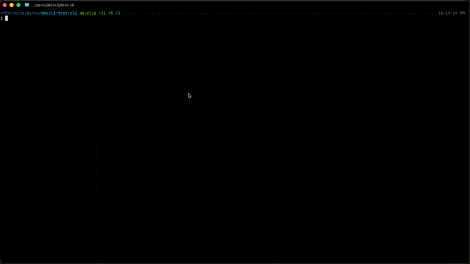
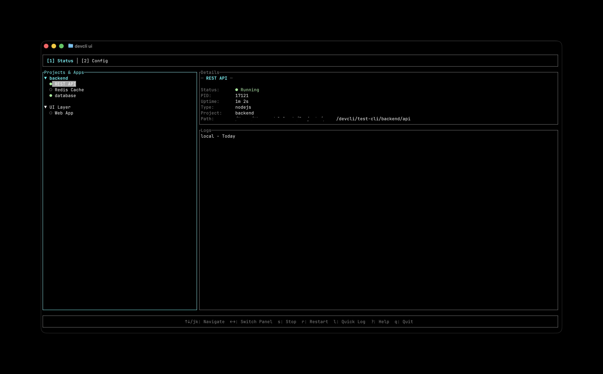
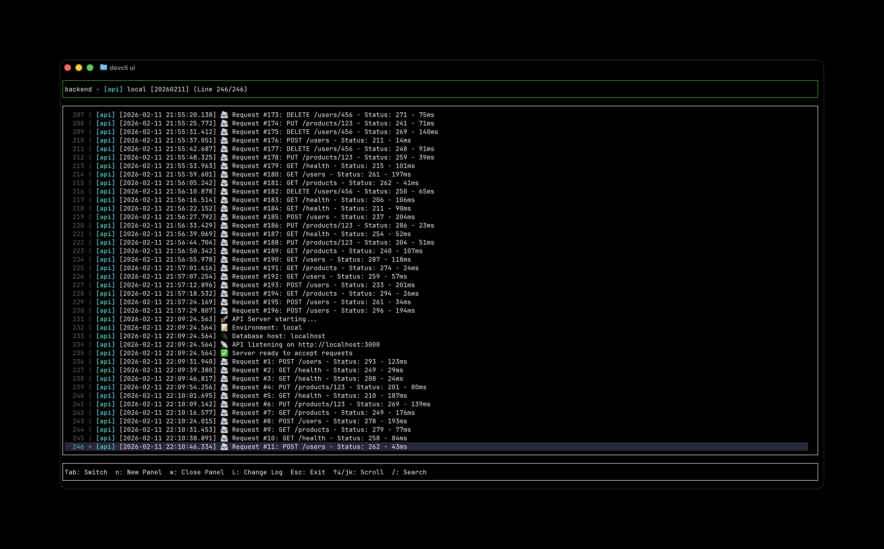
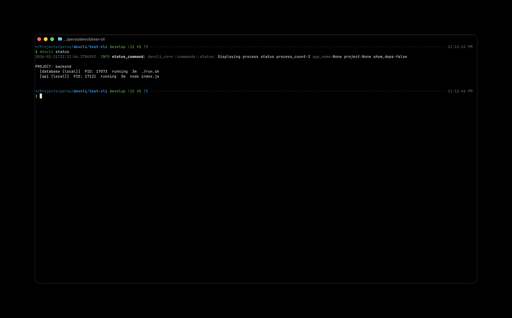

# DevCLI

Powerful process management CLI for developers. Manage multiple processes with automatic restarts, health checks, and a beautiful terminal UI.



## Showcase

### Interactive TUI Dashboard
Monitor all your processes in real-time.


### Multi-App Log Streaming
Watch logs from multiple apps simultaneously.


### Colorful CLI Status
Get quick insights into your process health.


## Getting Started

### 1. Initialize Configuration

Create a configuration file in `~/.devcli/config.json`:

```bash
devcli config init
```

This creates a template configuration that you can edit.

### 2. Edit Configuration

Edit your config file:

```bash
devcli config edit
```

Example configuration structure:

```json
{
  "projects": {
    "my-project": {
      "alternative_name": "ProjectX",
      "apps": {
        "api": {
          "type": "nodejs",
          "alternative_name": "Backend",
          "path": "~/Projects/my-project/api",
          "commands": {
            "local": {
              "start": "npm start",
              "test": "npm test",
              "build": "npm run build"
            },
            "docker": {
              "build": "docker build -t my-api .",
              "run": "docker run --name my-api -p 3000:3000 --rm my-api"
            }
          },
          "dependencies": [],
          "defaults": {
            "local": "start",
            "docker": "run"
          }
        }
      }
    }
  }
}
```

### 3. Validate Configuration

Check your configuration is valid:

```bash
devcli config validate
```

### 4. Set Preferences

Set your default environment (local or docker):

```bash
devcli pref set default-env local
```

## Usage

### Starting Processes

Start a process using its default command:

```bash
devcli start api
```

Start with a specific environment:

```bash
devcli start api --env docker
```

If app names are ambiguous across projects, specify the project:

```bash
devcli start api --project my-project
```

You can also use alternative names (configured via `alternative_name` field):

```bash
devcli start Backend  # Uses alternative_name instead of real name
```

### Running Specific Commands

Run a specific command variant:

```bash
devcli run api build
devcli run api test
```

With environment override:

```bash
devcli run api build --env docker
```

### Checking Status

View all running processes grouped by project:

```bash
devcli status
```

Filter by project:

```bash
devcli status --project my-project
```

Show a specific app with its dependencies:

```bash
devcli status api --deps
```

Example output:

```
PROJECT: my-project
  [api] (local)  PID: 12345  running  2h 15m  npm start
  [worker] (local)  PID: 12346  running  1h 30m  npm run worker

PROJECT: other-project
  [frontend] (local)  PID: 12347  running  45m  npm run dev
```

### Configuration Management

List all projects and apps:

```bash
devcli config list
```

List apps only:

```bash
devcli config list --apps-only
```

Show details of a specific app:

```bash
devcli config show api
```

### Preferences Management

Show current preferences:

```bash
devcli pref show
```

Set default environment:

```bash
devcli pref set default-env docker
```

Reset preferences to defaults:

```bash
devcli pref reset
```

## Features

### Config-Based Management

All processes are defined in `~/.devcli/config.json`:
- Centralized configuration for all projects and apps
- Support for multiple environments (local, docker)
- Default commands per environment
- Path expansion for home directory (~) and environment variables

### Dependency Resolution

Define dependencies between apps:

```json
{
  "dependencies": [
    {"project": "infrastructure", "app": "redis"},
    {"project": "infrastructure", "app": "traefik"}
  ]
}
```

devcli will:
- Check dependencies are running before starting an app
- Detect circular dependencies
- Provide clear error messages for missing dependencies

### Multi-Environment Support

Define separate commands for different environments:
- `local`: Commands for local development
- `docker`: Commands for Docker containers

Set your preferred environment once, or override per command.

### Project Grouping

Status command groups processes by project for better organization. Processes without config metadata are shown in "UNGROUPED" section.

### Privacy & Alternative Names

Use `alternative_name` for projects and apps to:
- Hide real names in screenshots and demos
- Use privacy-friendly names in TUI
- Start/stop apps using alternative names
- Share configuration examples publicly

```json
{
  "projects": {
    "internal-project": {
      "alternative_name": "ProjectX",
      "apps": {
        "sensitive-api": {
          "alternative_name": "Backend"
        }
      }
    }
  }
}
```

### Log Management

All process logs are automatically saved to:
```
~/.devcli/logs/<app-name>_<timestamp>.log
```

Logs include timestamps and are preserved for review.

### Process Tracking

Process information is stored in:
```
~/.devcli/pids/<app-name>.json
```

This includes:
- Process ID (PID)
- Command and working directory
- Environment variables
- Start time
- Project and app metadata
- Environment type (local/docker)
- Command variant used

## Documentation

Comprehensive documentation is available in the `docs/` directory:

### 📚 Documentation

- **[Getting Started](./docs/getting-started.md)** - Quick start guide with examples (5-minute setup)
- **[Configuration Reference](./docs/configuration-reference.md)** - Complete config file documentation
- **[Commands Reference](./docs/commands-reference.md)** - All CLI commands with examples
- **[Advanced Features](./docs/advanced-features.md)** - Health checks, metrics, logging, dependencies
- **[Troubleshooting](./docs/troubleshooting.md)** - Common issues and solutions

### Quick Links

- **Installation**: See [Getting Started](./docs/getting-started.md#installation)
- **Config Format**: See [Configuration Reference](./docs/configuration-reference.md#file-structure)
- **All Commands**: See [Commands Reference](./docs/commands-reference.md)
- **Health Checks**: See [Advanced Features](./docs/advanced-features.md#health-checks)
- **Metrics**: See [Advanced Features](./docs/advanced-features.md#metrics--monitoring)
- **Help**: See [Troubleshooting](./docs/troubleshooting.md)
