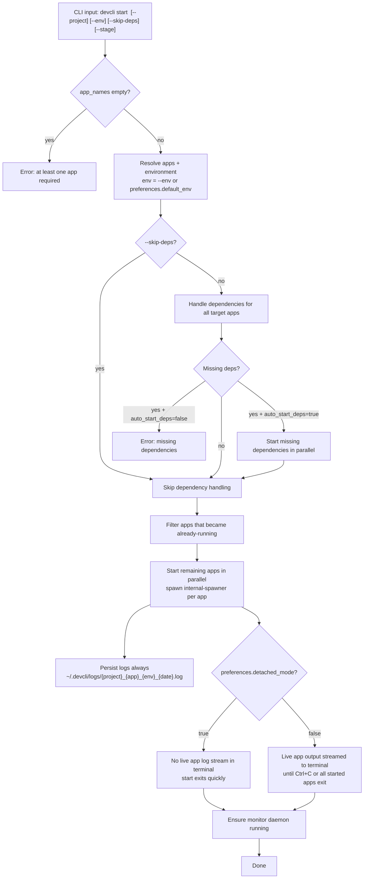
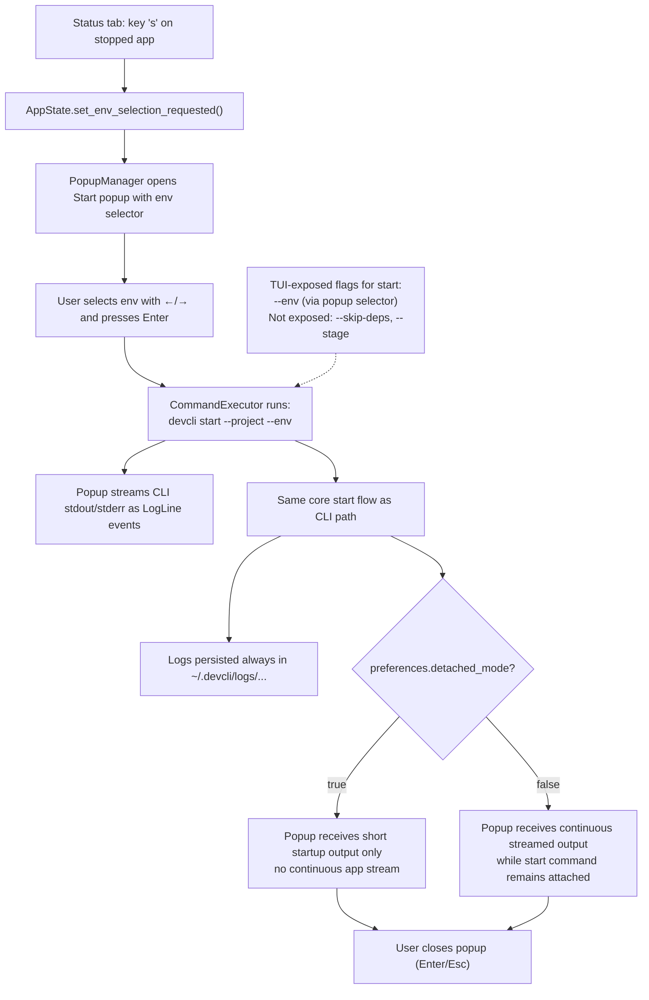
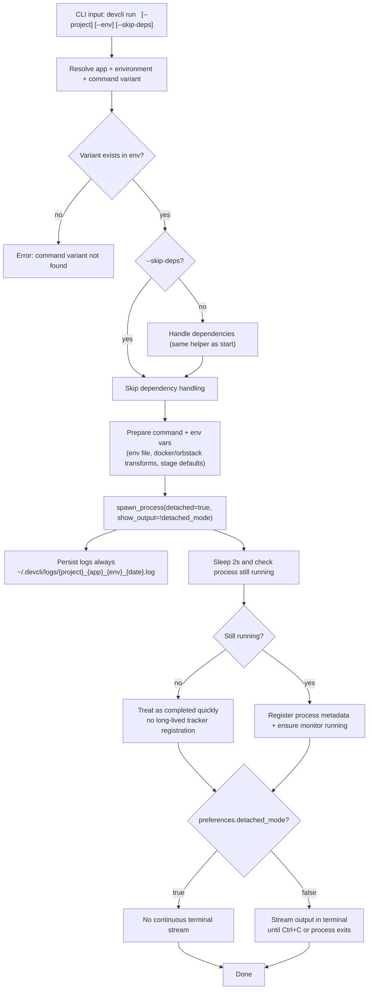
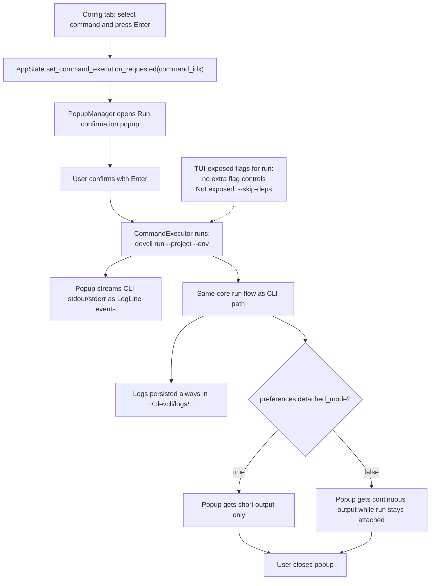
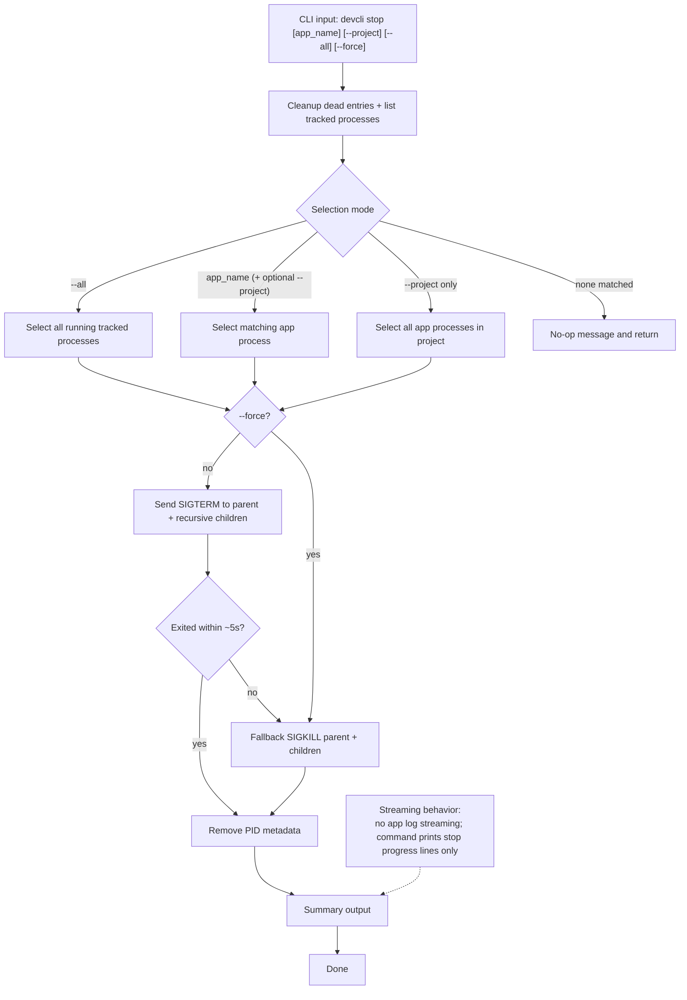
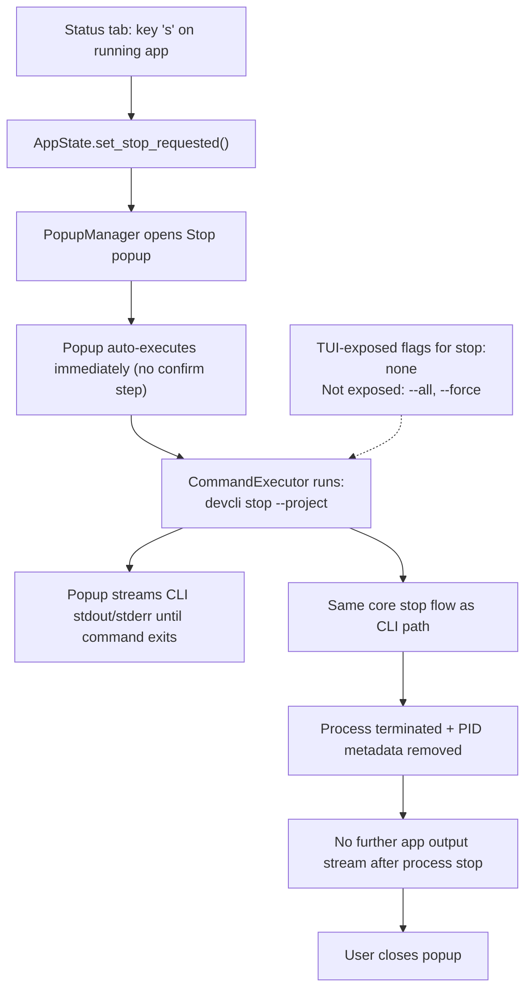
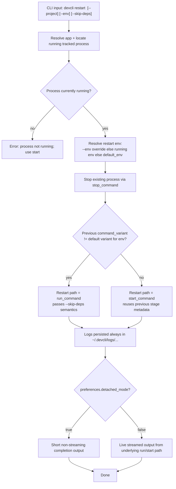
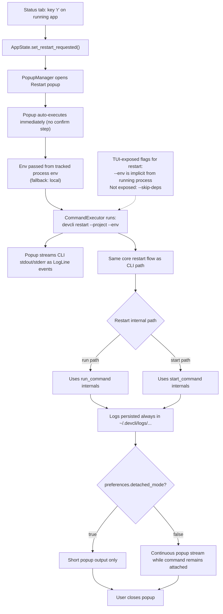

# devcli-core Command Flow Diagrams (CLI + TUI)

This file is diagrams-only, to validate flow behavior for:

1. `start`
2. `run`
3. `stop`
4. `restart`

Each command has:

- one **CLI** flowchart
- one **TUI** flowchart
- explicit branches for relevant flags
- explicit branch for output streaming vs non-streaming

## 1) `start` CLI

## 2) `start` TUI

## 3) `run` CLI

## 4) `run` TUI

## 5) `stop` CLI

## 6) `stop` TUI

## 7) `restart` CLI

## 8) `restart` TUI

