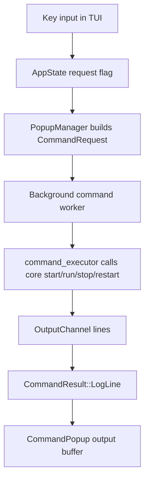
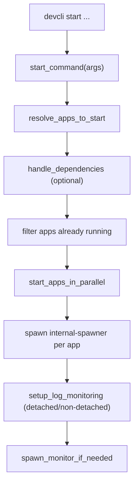

# devcli-core Command Lifecycle and Log Management

This document describes the **actual implementation** of process lifecycle commands in `devcli-core`, with a focus on:

1. `start`
2. `run`
3. `stop`
4. `restart`
5. Log handling in both **CLI** and **TUI** flows

It is based on the current code in:

- `devcli/src/main.rs`
- `devcli-core/src/commands/*`
- `devcli-core/src/process_manager_support.rs`
- `devcli-core/src/env_flow_support.rs`
- `env-flow/` (layered `.env` loader)
- `devcli-core/src/tui/*`
- `devcli-core/src/config/*`

## 1) Execution Paths: CLI vs TUI

### CLI path

`devcli/src/main.rs` parses CLI args and calls `devcli_core::commands::*` directly.

- `start`, `stop`, `restart` are called with `silent: false`
- `run` has no `silent` flag and always prints command-level output

### TUI path

TUI command actions (start, run, stop, restart) call the same `devcli-core` command functions **in-process** via `tui/command_executor.rs` — not subprocesses. Managed processes outlive the TUI session.

For any code that must spawn a devcli subprocess, use `process_manager_support::devcli_binary_path()` (honours `DEVCLI_BIN`, otherwise `current_exe()`).

## 2) Core Runtime Components

| Component | Responsibility |
|---|---|
| `commands/start/*` | Resolve apps, dependencies, spawn apps, log-monitor mode |
| `commands/run.rs` | Execute specific command variant for an app |
| `commands/stop.rs` | Graceful + forced termination and PID cleanup |
| `commands/restart.rs` | Stop + re-launch with prior runtime metadata |
| `commands/internal_spawner.rs` | Detached child process wrapper, stream + persist logs |
| `process_manager_support.rs` | Bridge to `process-manager` (`~/.devcli/processes`) |
| `env_flow_support.rs` | Bridge to `env-flow` (cascade local, container paths, parser) |
| `process-manager` + `pm-daemon` | Spawn, persist, monitor, health-check, and auto-restart managed processes |
| `commands/prepare.rs` | Env-flow loading + env var injection + docker command adaptation |
| `tui/log_manager.rs` | Discover log files in `~/.devcli/logs` |
| `tui/views/log_viewer/*` | Read and render persisted logs, refresh/search/json panel |

## 3) Data and File Layout

### Config and preferences

Loaded via `config/loader.rs` with priority:

1. `devcli_CONFIG_DIR` override (tests/dev)
2. `./.devcli/config.json` and `./.devcli/preferences.json` if present
3. `~/.devcli/config.json` and `~/.devcli/preferences.json`

### Process tracking metadata

Stored in `~/.devcli/processes`:

- One JSON file per managed process: `{project}.{app}.{environment}.json`
- `.status_changed` — mtime touch on every save/delete (TUI fast polling)
- `.daemon.lock` — exclusive lock held by `pm-daemon` while the monitor is alive
- `locks/{id}.lock` — per-process restart coordination

`process-manager` `StateStore::save()` and `delete()` touch `.status_changed` so the TUI can react within ~250ms.

### Runtime logs

Stored in `~/.devcli/logs`, file pattern:

`{project}_{app}_{environment}_{YYYYMMDD}.log`

Examples:

- `myproj_api_local_20260301.log`
- `myproj_worker_docker_20260301.log`

Both `start` and `run` append to this per-app/per-env/per-day file.

### Internal/tracing logs

`logging/tracing_setup.rs` initializes tracing with:

- console output
- daily-rotated JSON log file in `~/.devcli/logs` (`devcli.json` base name)

## 4) `start` Command: Detailed Flow

Implementation root: `commands/start/mod.rs`

High-level sequence:

## 4.1 Argument resolution and validation

`resolve_apps_to_start(args)` does:

1. Load config + preferences
2. Resolve target environment:
   - `args.env` if provided
   - else `preferences.default_env`
3. `tracker.cleanup_dead()`
4. For each requested app:
   - Resolve config app (`resolve_app` supports real name and `alternative_name`)
   - Check currently running process (`tracker.get_process(...)`)
   - Remove stale PID entries if process is dead
   - Validate environment and default command

If `app_names` is empty, `start_command` fails immediately.

## 4.2 Dependencies

If `--skip-deps` is not set, `handle_dependencies()`:

1. Builds dependency chains for all target apps (`resolve_dependency_chain`)
2. Deduplicates dependencies
3. Checks running state via tracker
4. If missing dependencies:
   - auto-starts in parallel if `preferences.auto_start_deps == true`
   - otherwise fails and asks user to start deps manually or use `--skip-deps`

Dependency starts use `start_single_app_internal(...)`.

## 4.3 Process spawn model for `start`

`start` does **not** spawn app processes directly from `start_command`.

`start_single_app_process(...)` creates a `SpawnerPayload` and spawns:

`devcli internal-spawner --payload <base64-json>`

Spawner launch characteristics:

- detached session (`setsid` on Unix)
- optional stdout/stderr piping to parent based on `show_output`
- 500ms liveness verification for the spawner process

## 4.4 Command preparation before spawn

`prepare_command(...)` applies environment-specific preparation via `env_flow_support`:

- Docker/OrbStack:
  - inject docker platform flags
  - resolve highest-priority env layer (or strict config-map path) and add `--env-file`
  - add dockerfile path for build commands if configured
  - set `DOCKER_CONTEXT` (`default` or `orbstack`)
- Local:
  - cascade-load env layers (`.env` + stage + `.env.local`) via `env-flow`, or strict config-map single file
  - inject merged variables into process environment map

Stage selection precedence:

1. CLI `--stage` override
2. app `default_stages[env]`
3. preferences `default_stage`

## 4.5 Log monitor behavior after spawn

`setup_log_monitoring(started_apps, silent)`:

- If `preferences.detached_mode == true`:
  - exits immediately after start
- Else:
  - stays alive until:
    - user Ctrl+C, or
    - all started app processes exit

Ctrl+C stops log viewing only; apps keep running in background.

## 4.6 Monitor daemon boot

After `start`, code calls `spawn_monitor_if_needed(...)`.

If monitor is not running, it spawns detached:

`devcli monitor --daemon`

## 5) `internal-spawner`: Detached Runtime Wrapper

Implementation root: `commands/internal_spawner.rs`

For each app started via `start`:

1. Decode and parse payload
2. Open log file in append mode
3. Spawn child app process with piped stdout/stderr
4. Short startup validation (`try_wait` after 100ms):
   - fatal start errors: exit code `127`, `126`, or negative
5. Register process in tracker
6. Stream child stdout/stderr:
   - forward lines to parent stdout/stderr
   - append timestamped lines to log file
   - stderr lines are tagged `[STDERR]` in file
7. Forward `SIGINT`/`SIGTERM` to child, ignore `SIGHUP`
8. On child exit:
   - write exit code to tracker (`update_exit_info`)
   - wait output tasks
   - remove process PID metadata

Important: tracker entry uses the spawner PID, not the child PID.

## 6) `run` Command: Detailed Flow

Implementation root: `commands/run.rs`

Sequence:

1. Load config + preferences
2. Resolve app + environment
3. Resolve requested command variant in selected environment
4. `tracker.cleanup_dead()`
5. Check running entry for same app/environment
6. Optionally check/start dependencies (same helper as `start`)
7. Build log file path (`{project}_{app}_{env}_{date}.log`)
8. `prepare_command(...)` (same preparation pipeline)
9. Spawn process via `process::spawn_process(...)` with `detached: true`
10. Sleep 2 seconds and check process liveness:
    - if already exited: treat as completed, do not register long-lived process
    - else: register in tracker and continue
11. Ensure monitor daemon is running
12. If non-detached preference: stay attached until Ctrl+C or process exit

`run` stores `command_variant` in process metadata.

## 7) `stop` Command: Detailed Flow

Implementation root: `commands/stop.rs`

Sequence:

1. `tracker.cleanup_dead()`
2. Build process selection set based on:
   - `--all`
   - app name (+ optional `--project`)
   - `--project` only
3. For each selected process:
   - if not `--force`:
     - send `SIGTERM` to parent + recursive child PIDs (`pgrep -P`)
     - wait up to ~5s (10 x 500ms)
   - fallback or `--force`:
     - send `SIGKILL` to parent + children
4. Verify termination
5. Remove PID metadata (`tracker.remove_process`)
6. Return aggregated error if any process failed to stop

`silent` controls terminal output only (used by TUI/automation contexts).

## 8) `restart` Command: Detailed Flow

Implementation root: `commands/restart.rs`

Sequence:

1. Resolve app/project from config (supports alternative name resolution)
2. `tracker.cleanup_dead()`
3. Find running process metadata for target app
4. Determine restart environment:
   - `--env` override if provided
   - else running process environment
   - else preferences default
5. Stop existing process (`stop_command`)
6. Decide re-launch strategy:
   - if previous `command_variant` differs from default for this env -> use `run`
   - otherwise -> use `start`
7. For `start` path, previous stage is reused from process metadata

If target process is not running, restart fails with guidance to use `start`.

## 9) CLI Log Handling

### `start` CLI output

- In non-detached mode, app output is streamed through internal-spawner piping
- Lines are prefixed by app display name in terminal output
- Persistent log file always receives timestamped lines

### `run` CLI output

- Uses `spawn_process()` stream handler
- Terminal output includes `[stdout]` or `[stderr]` tags in non-detached mode
- Persistent log file always receives timestamped lines

### Detached vs non-detached

- Detached (`preferences.detached_mode=true`): command exits quickly after spawn
- Non-detached: command keeps a foreground log-view loop until Ctrl+C or process exit

## 10) TUI Log Handling

### 10.1 Command popup streaming

When command popup is executing:

- each stdout/stderr line from spawned CLI command is pushed into popup buffer
- popup keeps last 1000 lines
- supports scroll + auto-scroll

These lines are ephemeral UI buffers, separate from persisted app log files.

### 10.2 Persisted logs in Status and Log Viewer

Status tab:

- uses `LogManager::list_logs_for_app(project, app)`
- reads `~/.devcli/logs`
- sorts by file modification time (newest first)

Log Viewer:

- opens selected log file(s)
- supports multi-panel (up to 4), search, JSON prettifier
- refreshes by detecting file size changes and reloading

Quick actions:

- `l` in Status tab opens latest log for selected running app
- `Enter` on selected log opens viewer

## 11) Status Refresh and Process Notifications (TUI)

TUI background polling combines:

1. fast checks (~250ms) on `.status_changed` timestamp
2. fallback full refresh every 2 seconds

When tracker metadata changes, UI marks state as updated and re-renders app statuses and popup status badges.

## 12) Current Implementation Notes and Caveats

These are current behaviors in code (useful when debugging):

1. Monitor auto-restart runs in `process-manager` (`Monitor` + `pm-daemon`). `devcli monitor --daemon` runs the same loop in the foreground for debugging.
2. Docker command rewriting in `utils/command.rs` uses `shell_words` for tokenization; OrbStack env prefixes remain shell-style strings.
3. **Dependency checks are cross-environment by design** — a dependency counts as running in any environment (e.g. Redis in Docker satisfies a local app). See `config/dependencies.rs`.
4. `run` and `start` share one process slot per `{project}.{app}.{environment}`; `status` and the TUI show environment and command variant when running.
5. `start` and `run` write to the same daily app/env log file (variant is not included in the log filename).
6. TUI command actions call shared core commands in-process (`command_executor.rs`); processes outlive the TUI. For any future subprocess spawn, use `process_manager_support::devcli_binary_path()` (`DEVCLI_BIN` or `current_exe()`).
7. In dependency deduplication, entries are keyed by `project/app` (not app name alone).

## 13) Quick Code Map

- CLI entry: `devcli/src/main.rs`
- Start orchestration: `devcli-core/src/commands/start/mod.rs`
- Start resolver/deps/spawn/logging:
  - `devcli-core/src/commands/start/resolver.rs`
  - `devcli-core/src/commands/start/dependencies.rs`
  - `devcli-core/src/commands/start/executor.rs`
  - `devcli-core/src/commands/start/logging.rs`
- Run/Stop/Restart:
  - `devcli-core/src/commands/run.rs`
  - `devcli-core/src/commands/stop.rs`
  - `devcli-core/src/commands/restart.rs`
- Internal spawner: `devcli-core/src/commands/internal_spawner.rs`
- Process layer:
  - `devcli-core/src/process_manager_support.rs`
  - `process-manager/` + `pm-daemon`
  - `devcli-core/src/commands/monitor.rs`
- TUI execution and logs:
  - `devcli-core/src/tui/app.rs`
  - `devcli-core/src/tui/popups/manager.rs`
  - `devcli-core/src/tui/command_executor.rs`
  - `devcli-core/src/tui/log_manager.rs`
  - `devcli-core/src/tui/views/log_viewer/mod.rs`
