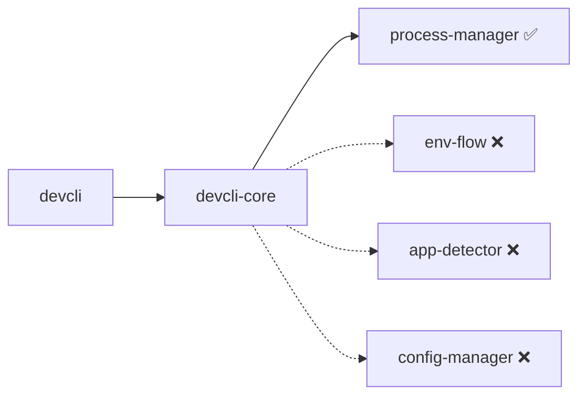

# Workspace Crate Audit Report

**Date:** 2026-06-28  
**Scope:** All 6 workspace crates vs original `devcli-core` inline code  
**Purpose:** Feature transfer status, integration gaps, test coverage  
**Status:** Read-only audit — no code changes

---

## Executive Summary

| Crate | Library built? | Integrated into `devcli-core`? | Feature transfer | Tests |
|-------|----------------|-------------------------------|------------------|-------|
| **process-manager** | ✅ | ✅ **Yes** | ✅ Complete | 45 — good, some gaps |
| **devcli-core** | ✅ | N/A (product) | Still owns detection/config/env logic | 324 — strong but uneven |
| **devcli** | ✅ | N/A (CLI shell) | Thin wrapper | 13 — minimal |
| **env-flow** | ✅ | ❌ **No** | ❌ Not transferred | 132 — strong for library |
| **app-detector** | ✅ | ❌ **No** | ❌ Not transferred | 100 — strong for library |
| **config-manager** | ✅ | ❌ **No** | ❌ Not transferred | 119* — needs `--all-features` |

**Total: 733 tests passing** (with `--all-features` on config-manager).

Only **process-manager** completed the full extract → integrate path. The other three libraries exist alongside **duplicate logic still living in `devcli-core`**.

```
devcli-core dependencies today:
  ✅ process-manager
  ❌ env-flow
  ❌ app-detector
  ❌ config-manager
```

### Key Findings

1. **Only `process-manager` is integrated.** The old `devcli-core/src/process/` module is gone.
2. **`env-flow`, `app-detector`, and `config-manager` are extractions, not migrations.** The product still uses inline code in `devcli-core`.
3. **Test coverage is uneven.** Strong in detection/config/start; weak on lifecycle commands, TUI orchestration, and product integration paths.
4. **`config-manager` breaks `cargo test --workspace`** without `--all-features` due to encryption test gating.

---

## Integration Architecture



### Duplication Map

| Concern | Lives in devcli-core | Extracted to | Integrated? |
|---------|---------------------|--------------|-------------|
| Process lifecycle | adapter only | process-manager | ✅ |
| Env file loading | `env_files.rs` + `prepare.rs` | env-flow | ❌ |
| App detection | `detection/` | app-detector | ❌ |
| Config load/resolve | `config/` | config-manager | ❌ |
| Levenshtein fuzzy match | `resolver.rs` | config-manager/utils | ❌ duplicated |

---

## Test Coverage Heatmap

| Area | process-manager | env-flow | app-detector | config-manager | devcli-core |
|------|:-:|:-:|:-:|:-:|:-:|
| Core library logic | 🟢 | 🟢 | 🟢 | 🟢 | 🟢 |
| Integration with product | 🟡 | 🔴 | 🔴 | 🔴 | — |
| Edge cases / e2e | 🟡 | 🟢 | 🟢 | 🟡 | 🟡 |
| CI without flags | 🟢 | 🟢 | 🟢 | 🔴 | 🟢 |

### Test Counts (verified 2026-06-28)

```bash
cargo test -p app-detector       # 100 passed
cargo test -p config-manager --all-features  # 119 passed
cargo test -p devcli             # 13 passed
cargo test -p devcli-core        # 324 passed
cargo test -p env-flow           # 132 passed
cargo test -p process-manager    # 45 passed

cargo test -p config-manager     # FAILS — EncryptedLoader not found
cargo test --workspace           # FAILS without --all-features
```

---

## 1. process-manager — ✅ DONE (integrated)

### Feature Transfer

| Original (`devcli-core/process/`) | New location | Status |
|-----------------------------------|--------------|--------|
| Process spawning (attached/detached) | `engine::spawn` | ✅ |
| PID / state tracking | `StateStore` JSON files | ✅ |
| Termination | `engine::terminate` (PGID-aware) | ✅ |
| Health checks | `HealthCheckEngine` | ✅ |
| Auto-restart / backoff | `Monitor` + `RestartPolicy` | ✅ |
| Log streaming | Engine output handlers | ✅ |
| Background daemon | `pm-daemon` | ✅ (new design) |

`devcli-core/src/process/` **no longer exists**. A thin adapter (`process_manager_support.rs`) handles devcli-specific paths, metadata, and TUI output.

### What Stayed in devcli-core (by design)

- Config resolution (apps, envs, deps)
- CLI command orchestration (start/stop/restart/run)
- TUI output routing
- Metrics HTTP server
- Config → PM type mapping (`to_pm_health_check`, etc.)

### Module Structure

```
process-manager/
├── engine      — Process spawning, termination, group management, liveness probe
├── state       — JSON persistence, daemon lifecycle (ensure_daemon_running)
├── monitor     — Health check + auto-restart loop (runs inside pm-daemon)
├── restart     — File-lock coordination preventing thundering-herd restarts
├── health      — HTTP / TCP / Command health check execution
└── bin/
    └── pm-daemon — Background singleton daemon (spawned automatically)
```

### Tests — 45 passing

| Area | Coverage | Gaps |
|------|----------|------|
| `StateStore` CRUD, metadata, backoff | ✅ 16 tests | — |
| Model serde | ✅ 8 tests | — |
| Health checks | ⚠️ 9 tests | HTTP/TCP success paths untested |
| Restart file locks | ✅ 3 tests | — |
| Engine spawn/terminate | ⚠️ 3 unit + 6 integration | No shell-words quoting, SIGTERM, detached mode tests |
| **`Monitor` loop** | ❌ 0 unit tests | Health-failure restart (3-strike) untested |
| `pm-daemon` | ⚠️ 1 indirect e2e in devcli-core | Skips if binary not built |

### devcli-core Usage

**Dependency:** `devcli-core/Cargo.toml` → `process-manager = { path = "../process-manager" }`

**Files importing process_manager (18 source files):**

- `process_manager_support.rs`
- `commands/start/executor.rs`, `run.rs`, `stop.rs`, `restart.rs`, `monitor.rs`, `health_check.rs`, `status.rs`, `internal_spawner.rs`
- `commands/start/resolver.rs`, `dependencies.rs`, `logging.rs`, `mod.rs`
- `config/dependencies.rs`
- `tui/app.rs`, `tui/state.rs`, `tui/popups/manager.rs`, `tui/command_executor.rs`
- `metrics/collector.rs`
- `integration_tests.rs`

### Known Issues

1. **Stale docs** still reference `devcli-core/src/process/tracker.rs`, `spawn_process` (`docs/devcli-core-command-lifecycle.md`, `MIGRATION.md`).
2. **Duplicated mapping helpers:** `to_pm_health_check` in `process_manager_support.rs`, `start/executor.rs`, and `run.rs`.
3. **`internal_spawner`** always uses `HealthCheck::Process {}` and `RestartPolicy { enabled: false }` — no config health/restart policy in detached path.
4. **`RestartReason` enum** in `restart.rs` is defined but never used.
5. **Windows:** `engine::terminate` and `StateStore::is_running` bail or return false on non-Unix.

### Verdict

**Feature transfer: complete.** Minor cleanup: duplicated helpers, stale docs, internal_spawner policy gap.

---

## 2. env-flow — ✅ LIBRARY DONE, ❌ NOT INTEGRATED

### Feature Transfer

`env-flow` is a standalone 6-layer `.env` loader. **`devcli-core` still uses its own logic** in `detection/environments/env_files.rs` + `commands/prepare.rs`.

**No dependency link** — confirmed: no `env-flow` in `devcli-core/Cargo.toml`, no `use env_flow` anywhere in devcli-core.

### Layer Model (env-flow)

```
Layer 1 (lowest):  .env
Layer 2:           .env.{context}  OR  {context}/.env        ← skipped for Local
Layer 3:           .env.{stage}
Layer 4:           .env.{stage}.{context}  OR  {context}/.env.{stage}  ← skipped for Local
Layer 5:           .env.local                                ← skipped in Docker/K8s/CI
Layer 6 (highest): .env.{stage}.local                        ← skipped in containers/CI
```

### Feature Parity Matrix

| Capability | env-flow | devcli-core (current) |
|------------|:--------:|:---------------------:|
| Multi-layer cascade merge | ✅ | ❌ single file only |
| `${VAR}` interpolation | ✅ | ❌ |
| Robust parser (multiline, export, escapes) | ✅ | ❌ naive line-split |
| Source tracking / override history | ✅ | ❌ |
| `layers()` introspection | ✅ | ❌ |
| `auto_detect` stage/context | ✅ | ❌ |
| Config `env_files` map (strict) | ❌ | ✅ |
| Interactive env assignment (auto_add) | ❌ | ✅ |
| Docker ↔ OrbStack aliasing | ❌ | ✅ |
| Dockerfile-nested paths | ❌ | ✅ |
| `.*.env` reverse pattern (`.local.env`) | ❌ | ✅ |
| Empty value → `"XXX"` placeholder | ❌ | ✅ |
| Docker `--env-file` injection | ❌ | ✅ (in prepare.rs) |
| Typed `Stage` enum | ✅ | ❌ (uses `&str`) |
| `DockerCompose` / `CI` contexts | ✅ | ❌ |

### devcli-core Env Loading (current)

| Function | Location | Behavior |
|----------|----------|----------|
| `detect_env_files` | `env_files.rs` | Scan app root + dockerfile parent; classify by filename |
| `parse_env_file` | `env_files.rs` | Single file, naive `KEY=VALUE`; empty → `"XXX"` |
| `find_env_file` | `env_files.rs` | Pick **one file** by priority (stage + dockerfile dir) |
| `load_env_vars_for_runtime` | `env_files.rs` | `find_env_file` → `parse_env_file` |
| `resolve_env_file_path` | `env_files.rs` | Config map lookup; strict if map present |
| Runtime consumption | `prepare.rs` | Docker: `--env-file`; Local: parse single file |

### Tests — 132 passing

| Location | Count (approx) | Scope |
|----------|----------------|-------|
| `tests/integration_tests.rs` | 35 | Fixture-based end-to-end |
| `src/lib.rs` (inline) | 24 | TempDir builder API |
| `src/parser.rs` | 19 | Parser unit tests |
| `src/resolver.rs` | 9 | Layer chain resolution |
| `src/detector.rs` | 10 | Filename classification |
| `src/interpolator.rs` | 9 | `${VAR}` expansion |
| `src/context.rs` | 8 | Auto-detect |
| `src/loader.rs` | 5 | Merge + source tracking |
| `src/types.rs` | 5 | Stage/context helpers |

**Fixtures:** `minimal`, `local-overrides`, `staged`, `staged-with-local`, `docker-dir-style`, `docker-suffix-style`, `kubernetes`, `ci`, `full-stack`, `no-cascade`, `single-file`, `edge-cases/*`

### Test Gaps (env-flow)

| Gap | Detail |
|-----|--------|
| `auto_detect` E2E | Only unit tests in `context.rs` |
| `OrbStack` / `DockerCompose` runtime loading | Enum exists; no dedicated fixture |
| `strict` mode E2E | Parser unit tests only |
| Nested dockerfile dirs | e.g. `build/docker/.env` — not in env-flow model |
| Config map / devcli integration | N/A until integrated |

### devcli-core Env Tests — ~19 tests

| Location | Count | Scope |
|----------|-------|-------|
| `env_files.rs` mod tests | 10 | Filename parsing, detection, map building |
| `orbstack_stage_test.rs` | 9 | `find_env_file`, priority |

**Missing in devcli-core:** `parse_env_file`, `resolve_env_file_path`, `prepare.rs` integration, cascade/local merge.

### Recommended Integration Order

1. Add `env-flow` to `devcli-core/Cargo.toml`
2. Swap `parse_env_file` implementation (thin wrapper → env-flow parser)
3. Enable cascade for **local** in `prepare.rs`
4. Add bridge for `env_files` config map
5. Extend resolver for dockerfile-relative roots
6. Revisit docker `--env-file` strategy (single vs cascade → temp file)
7. Deprecate duplicate logic in `env_files.rs` incrementally

### Key Files

| Purpose | Path |
|---------|------|
| env-flow entry + API | `env-flow/src/lib.rs` |
| Layer resolver | `env-flow/src/resolver.rs` |
| devcli env logic | `devcli-core/src/detection/environments/env_files.rs` |
| Runtime consumption | `devcli-core/src/commands/prepare.rs` |
| Integration tests | `env-flow/tests/integration_tests.rs` |

### Verdict

**Library: production-ready. Integration: not started.** Highest-value next integration — replace single-file loading with cascade for local runs, then bridge config map.

---

## 3. app-detector — ✅ LIBRARY DONE, ❌ NOT INTEGRATED

### Feature Transfer

Strategy-based detection engine with 11 built-in strategies. **`auto_add` still calls `devcli-core/detection/` directly** — no Cargo dependency.

**Transfer status: 0% integrated.** Parallel implementations with ~94 tests each, different architectures.

### Architecture Comparison

**app-detector:** Strategy-based engine with 3-phase detection

1. Phase 1 — App types (languages, monorepos, services, env-files)
2. Phase 1.5 — Hierarchical workspace recursion (`DetectionReport.children`)
3. Phase 2 — Environment capabilities (docker, orbstack, k8s, nx-env, local-env)

**devcli-core:** Function-based inline module

1. `detect_app_type()` → single string type
2. Parallel env detection → flat `DetectedApp` struct

### Registered Strategies (app-detector)

| Phase | Strategies |
|-------|------------|
| App type | `env-files`, `nx`, `rust`, `nodejs`, `python`, `redis`, `traefik` |
| Env cap | `docker`, `orbstack-env`, `kubernetes-env`, `nx-env`, `local-env` |

### Feature Parity Matrix

| Capability | app-detector | devcli-core |
|------------|:------------:|:-----------:|
| Node.js / Python detection | ✅ | ✅ |
| **Rust detection** | ✅ | ❌ |
| **docker-compose commands** | ✅ | ❌ |
| Nx monorepo (hierarchical tree) | ✅ Phase 1.5 | ⚠️ flat loop |
| Nx `libs/` scanning | ✅ | ❌ (apps/packages only) |
| **`nx show project` (runtime CLI)** | ❌ | ✅ |
| Interactive env file mapping | ❌ | ✅ |
| Runtime env loading | ❌ | ✅ |
| Per-config Redis/Traefik splitting | ❌ | ✅ |
| OrbStack stage env priority | ❌ | ✅ (9 tests) |
| Plugin/extensibility | ✅ | ❌ |

### Duplication Map

| devcli-core | app-detector equivalent | Notes |
|-------------|-------------------------|-------|
| `detect_app_type()` | Phase 1 strategies | devcli: one winner; app-detector: multiple composable results |
| `detect_local_commands()` | `LocalEnvStrategy` | app-detector adds Rust local commands |
| `detect_docker_commands()` | `DockerStrategy` | Different command naming & compose support |
| `detect_orbstack_commands()` | `OrbStackEnvStrategy` | Both reuse Docker data |
| `detect_k8s_commands()` | `KubernetesEnvStrategy` | Similar scope |
| `detect_env_files()` | `EnvFilesStrategy` | devcli adds runtime load + interactive mapping |
| `detect_nx_apps()` | `NxStrategy` + Phase 1.5 + `NxEnvStrategy` | Very different Nx approaches |

### Tests — 100 passing

| File | Count | Type |
|------|-------|------|
| `tests/integration_test.rs` | 11 | Fixture-based E2E |
| `tests/combination_test.rs` | 13 | Multi-scenario fixtures |
| `tests/hierarchical_test.rs` | 10 | Phase 1.5 monorepo |
| Strategy unit tests | ~66 | Various |

**Integration fixtures (18 scenarios):** `nodejs-docker`, `nodejs-react`, `nodejs-full`, `nodejs-docker-compose`, `rust-project`, `python-app`, `nx-monorepo`, `nx-mixed-workspaces`, `redis-service`, `traefik-proxy`, `k8s-app`, etc.

### devcli-core Detection Tests — ~94 tests

- Tempfile-based (no shared fixtures with app-detector)
- Strong on OrbStack stage priority, `nx show project`
- **Missing:** Rust, docker-compose-only, hierarchical Nx tree

### Documentation Issues

- app-detector README claims devcli uses it — **incorrect today**
- CHANGELOG has contradictory Phase 2 status (Added vs TODO)
- README test count stale (claims 71–81; actual ~100)

### Verdict

**Library: feature-rich but divergent.** Integration needs an adapter layer (`DetectionReport` → `DetectedApp`) and decisions on which side wins for Nx (static JSON vs `nx show project`).

---

## 4. config-manager — ✅ LIBRARY DONE, ❌ NOT INTEGRATED

### Feature Transfer

Generic trait-based config library. **`devcli-core/config/` is fully self-contained.**

**Transfer status: 0% integrated.** README claim that devcli uses it in production is **incorrect**.

### Feature Parity Matrix

| Capability | config-manager | devcli-core |
|------------|:--------------:|:-----------:|
| JSON load/save | ✅ generic | ✅ fixed `~/.devcli/` paths |
| TOML/YAML/HTTP/S3/encryption | ✅ feature-gated | ❌ JSON only |
| Layered config / deep merge | ✅ | ❌ |
| Schema validation | ✅ feature-gated | ❌ hand-rolled |
| Fuzzy matching (Levenshtein) | ✅ | ✅ duplicated |
| Dependency resolution | ✅ DFS + cycle error | ⚠️ BFS, **weak cycle detection** |
| Runtime dep checking | ❌ | ✅ (process-manager) |
| Domain models (App, HealthCheck, Stage…) | ❌ generic `T` | ✅ |
| CLI `devcli config *` commands | ❌ | ✅ |
| TUI config editor | ❌ | ✅ |

### ⚠️ CI Issue

```bash
cargo test -p config-manager          # FAILS — EncryptedLoader not found
cargo test -p config-manager --all-features  # 119 passed ✅
cargo test --workspace                # FAILS without --all-features
```

**Root cause:** `tests/integration/error_handling.rs` and `tests/integration/layered_encryption.rs` import `EncryptedLoader` without `#[cfg(feature = "encryption")]`.

CI (`.github/workflows/ci.yml`) uses `--all-features` so GitHub Actions passes; local default test fails.

### Critical Behavioral Gap: Circular Dependencies

- **config-manager** (`DependencyGraph::visit`): DFS with `in_progress` → returns `Error::CircularDependency` for A→B→A.
- **devcli-core** (`resolve_dependency_chain`): BFS marks nodes `visited`; A→B→A returns `Ok([B])` without error.
- **devcli-core tests** (`validation_tests.rs`) expect `Ok` for circular deps — misaligned with `config validate` which expects errors.

### Tests — 119 passing (with `--all-features`)

| Area | Count | Coverage |
|------|-------|----------|
| JSON/TOML/YAML loaders | ~26 | Save/load, async, formats |
| Dependency graph + cycles | 6 | Chain, linear, circular, topological sort |
| Fuzzy resolver | 8 | Exact, fuzzy, suggest |
| Layered + encrypted merge | 3 integration | Override, deep merge |
| Core manager/builder | 5 | Load/save, validation hook |
| HTTP/S3 loaders | 4 | Creation only — no real I/O |
| Schema validation | 5 | Requires `schema` feature |
| Watch | 5 | Requires `watch` feature |

### devcli-core Config Tests — ~44 tests

| Area | Count | Gaps |
|------|-------|------|
| Model serialization | 13 | — |
| Resolution / ambiguity | 5 | No `alternative_name` tests |
| Dependency chains | 4 | Cycle test expects `Ok` — misaligned |
| Config commands | 19 | Assert in-memory structs; don't call `config_validate()` etc. |
| Loader path priority | 0 | `devcli_CONFIG_DIR` / cwd / home untested |

### Recommended Migration Sequence

1. Add `config-manager` to `devcli-core/Cargo.toml` with minimal features
2. Implement adapter: `JsonLoader` + devcli path resolution + `Config`/`Preferences` types
3. Implement `DependencyProvider` / `Resolver` for `App` entities keyed by `project/app`
4. Replace duplicated Levenshtein with `config_manager::utils`
5. Gate encryption integration tests with `#[cfg(feature = "encryption")]`
6. Align cycle detection: adopt config-manager DFS or fix devcli BFS + update tests
7. Add loader + `config_validate` integration tests before removing legacy code

### Verdict

**Library: mature extraction. Integration: not started.** Behavioral mismatch on circular dependency detection is a real risk if migrated naively.

---

## 5. devcli-core — ✅ PRODUCT COMPLETE, ⚠️ STILL MONOLITHIC

The main product crate. ~147 source files, **324 tests**.

### Module Inventory

| Module | Role | Tests | Refactored? |
|--------|------|-------|-------------|
| `commands/start/` | Start + deps + executor | 20 | ✅ split |
| `commands/auto_add/` | Auto-detect & add | 22 | ✅ split |
| `commands/config/` | Config CRUD | 19 | ✅ split |
| `commands/restart,stop,run,status` | Lifecycle | **0** | ❌ monolithic |
| `commands/prepare.rs` | Env/docker prep | **0** | ❌ |
| `commands/monitor.rs`, `internal_spawner.rs` | Daemon/spawner | **0** | ❌ |
| `commands/env.rs`, `preferences.rs` | Env/pref management | **0** | ❌ |
| `detection/` | Inline detection | 94 | Partially split |
| `config/` | Inline config | 25 | Partially split |
| `tui/main_view/` | Main TUI | 27 | ✅ refactored |
| `tui/app.rs` | TUI orchestrator (~840 lines) | 3 | ❌ |
| `tui/log_viewer/` | Log viewer (~1185 lines) | 3 | ⚠️ partial |
| `tui/command_popup.rs` | (~1003 lines) | 3 | ❌ |
| `tui/command_executor.rs` | TUI command execution | **0** | ❌ |
| `metrics/` | Metrics HTTP API | 9 | ✅ |
| `process_manager_support.rs` | PM adapter | **0** | — |
| `integration_tests.rs` | Cross-module workflows | 17 | — |

### Test Counts by Area

| Area | `#[test]` count | Notable test files |
|------|-----------------|-------------------|
| **commands/** | 63 | start (20), auto_add (22), config (19), health_check (2) |
| **tui/** | 72 | main_view_tests (27), widgets/tests (12), tui/tests (10) |
| **detection/** | 94 | app_types_tests (19), environment (10), utility (10) |
| **config/** | 25 | config_tests (13), resolution (5), dependency (4) |
| **utils/** | 33 | command_tests (25) |
| **metrics/** | 9 | collector (5), types (3), server (1) |
| **logging/** | 2 | tracing_setup only |
| **integration_tests** | 16 + 1 tokio | detection→config→process→metrics workflows |

### Monolithic Files (refactor targets)

| File | Lines (approx) | Status |
|------|----------------|--------|
| `tui/views/log_viewer/mod.rs` | ~1,185 | Submodules extracted; render + input still in mod.rs |
| `tui/widgets/command_popup.rs` | ~1,003 | Called out in REFACTORING docs |
| `tui/app.rs` | ~840 | TuiApp god-object |
| `detection/environments/env_files.rs` | ~780 | Env detection + parsing + runtime loading |
| `tui/views/main_view/input_handler.rs` | ~741 | Large even post-split |
| `config/models.rs` | ~718 | All domain types + validation |
| `detection/nx.rs` | ~654 | Nx workspace logic |
| `commands/config/edit.rs` | ~637 | Largest config command module |

**Completed refactor:** `main_view` — was 2,922 lines; now 19 files under `tui/views/main_view/` with 27 tests.

### Dependencies (what the product actually uses)

| Dependency | Used for |
|------------|----------|
| `process-manager` | **Only workspace sibling wired in** |
| `tokio`, `serde`, `anyhow`, `chrono` | Core async/serialization |
| `ratatui`, `crossterm`, `syntect` | TUI + log highlighting |
| `inquire` | Interactive CLI prompts |
| `tracing` + subscribers | Structured logging |
| `reqwest` | HTTP health checks |
| `shell-words` | Command parsing |

**Not in Cargo.toml:** `app-detector`, `config-manager`, `env-flow`

### Coverage Blind Spots (prioritized)

1. **Lifecycle commands** — restart/stop/run/status: zero direct tests
2. **`prepare.rs`** — shared env/docker injection for start/run
3. **TUI orchestration** — `app.rs`, `command_executor.rs`, log viewer input/render
4. **`process_manager_support.rs`** — adapter untested
5. **Config command handlers** — tests don't invoke async `config_validate()`, `config_list()`, etc.
6. **Loader path priority** — untested

### Feature Inventory

| Feature | Implementation home | Test depth |
|---------|---------------------|------------|
| Multi-app start with deps | `commands/start/` | Strong |
| Auto-detect & add apps | `commands/auto_add/` + `detection/` | Strong |
| Config CRUD (CLI + TUI) | `commands/config/` + TUI config_editor | Good (CLI); TUI partial |
| Env file management | `commands/env/` + detection env_files | Detection strong; CLI commands untested |
| Process lifecycle | restart/run/stop/status + process-manager | Weak |
| Health checks | config models + process-manager | Minimal (2 tests) |
| Monitor daemon + metrics HTTP | monitor + metrics/ | Metrics good; monitor sparse |
| Interactive TUI | `tui/` | main_view good; app/log_viewer weak |
| Preferences | preferences + config loader | Indirect via integration_tests only |
| Hidden internal spawner | internal_spawner | Untested |

### Verdict

**Product features: complete for current scope.** Architecture debt: three sibling crates duplicate detection/config/env logic. Large TUI files still need the `main_view` treatment.

---

## 6. devcli — ✅ THIN SHELL, ⚠️ MINIMAL TESTS

### Structure

| File | Role | Lines (approx) |
|------|------|----------------|
| `cli.rs` | clap `Cli` / `Commands` / sub-enums | 596 |
| `lib.rs` | Maps parsed CLI → `devcli_core::commands::*` | 200 |
| `main.rs` | Parse, init tracing, call `run()` | 18 |
| `tests/smoke.rs` | Binary integration smoke tests | 52 |

**Dependencies:** `devcli-core`, `clap`, `tokio`, `anyhow` only.

### CLI Surface

| Command group | Subcommands / actions |
|---------------|----------------------|
| Lifecycle | `start`, `restart`, `stop`, `run`, `status` |
| Ops | `health-check`, `monitor`, `metrics`, `internal-spawner` (hidden) |
| Config | `config init/validate/list/show/edit/add-command/remove-command/set-default/list-commands/edit-command` |
| Env | `env add/remove/list/set-default` |
| Prefs | `pref set/show/reset` |
| UX | `auto-add`, `ui` |

### Tests — 13 passing

| Location | Tests | Coverage |
|----------|-------|----------|
| `cli.rs` mod tests | 9 | clap parsing all command groups; missing/unknown subcommand; `console_tracing_enabled` |
| `tests/smoke.rs` | 4 | `--help`, `--version`, no-args error, hidden spawner not in help |
| `lib.rs` / `main.rs` | 0 | Dispatch wiring and tracing bootstrap untested |

### Verdict

**Correctly thin.** Test gap is acceptable for a parser wrapper, but end-to-end smoke tests for read-only commands would add confidence.

---

## Answers to Key Questions

### Are all features from the base correctly transferred to the crates?

**Only for `process-manager`.** For the other three:

- **env-flow** — library is *more capable* than devcli-core's inline code, but devcli-core never switched over
- **app-detector** — library has *different* capabilities (Rust, compose, hierarchical Nx) but lacks devcli-specific behavior (interactive env, `nx show project`, runtime loading)
- **config-manager** — library has *broader* I/O (encryption, layered, schema) but lacks devcli domain models and CLI commands

These are **extractions**, not **migrations**. The base code is still the source of truth for the product.

### Are all tests present and covering everything?

**No crate has complete coverage.**

| Crate | Library tests | Product integration tests | Critical gaps |
|-------|--------------|--------------------------|---------------|
| process-manager | Good | 1 conditional e2e | Monitor loop, engine edge cases |
| env-flow | Excellent | None | N/A until integrated |
| app-detector | Excellent | None | N/A until integrated |
| config-manager | Good (needs `--all-features`) | None | Feature-gated test compile bug |
| devcli-core | Strong in detection/config/start | Weak on lifecycle/TUI | restart/stop/run/status, prepare, app.rs |
| devcli | Minimal | 4 smoke tests | No real command execution |

---

## Recommended Priority (for follow-up)

### Immediate (unblocks CI)

1. **Fix config-manager test gating** — `#[cfg(feature = "encryption")]` on integration tests so `cargo test --workspace` passes without flags

### Integration (highest product value)

2. **Integrate env-flow** — lowest-risk, highest immediate value (parser + local cascade)
3. **Decide app-detector strategy** — wire in with adapter, or treat as reference and deprecate
4. **Decide config-manager strategy** — wire in for loader/resolver, or keep devcli-specific config

### Quality (devcli-core)

5. **Fill test gaps** — lifecycle commands, `prepare.rs`, config command e2e, `process_manager_support.rs`
6. **Refactor remaining monoliths** — `app.rs`, `log_viewer/mod.rs`, `command_popup.rs`

### Cleanup

7. **Sync stale docs** — `SUMMARY.md`, `PROJECT_RULES.md`, `docs/devcli-core-command-lifecycle.md`, app-detector README
8. **Consolidate duplicated helpers** — `to_pm_health_check` in process-manager integration
9. **Fix circular dependency detection** — align devcli-core BFS with config-manager DFS before any migration

---

## Related Documentation

| Document | Relevance |
|----------|-----------|
| `process-manager/MIGRATION.md` | Process extraction guide (partially stale) |
| `devcli-core/REFACTORING_STATUS.md` | main_view refactor complete; lists next targets |
| `env-flow/README.md` | Layer model and API reference |
| `app-detector/IMPLEMENTATION_SUMMARY.md` | Strategy architecture |
| `config-manager/docs/MIGRATION.md` | Aspirational migration from devcli-core |
| `docs/devcli-core-command-lifecycle.md` | Command flow (references old process/ paths) |

---

*Generated from workspace audit on 2026-06-28. Re-run test counts with:*

```bash
for c in app-detector config-manager devcli devcli-core env-flow process-manager; do
  echo -n "$c: "
  cargo test -p "$c" --all-features 2>&1 | rg -o '[0-9]+ passed' | head -1
done
```
